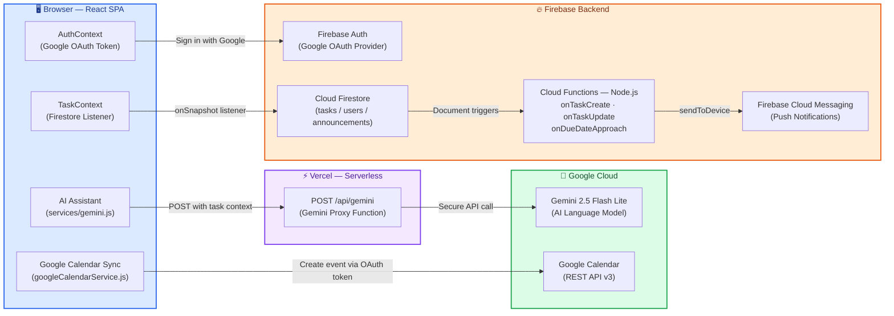

# AirBuddy Aerospace WorkSpace

A modern, role-based **workforce management platform** built for aerospace teams. It provides real-time task tracking, an AI-powered assistant, Google Calendar sync, push notifications, and a comprehensive admin panel — all backed by Firebase and deployed on Vercel.

---

## 📋 Table of Contents

- [Overview](#overview)
- [Tech Stack](#tech-stack)
- [Features](#features)
- [Project Structure](#project-structure)
- [Architecture](#architecture)
- [Firestore Schema](#firestore-schema)
- [Security Model](#security-model)
- [Environment Variables](#environment-variables)
- [Getting Started](#getting-started)
- [Setting Up the First Admin](#setting-up-the-first-admin)
- [Deployment](#deployment)
- [Available Scripts](#available-scripts)

---

## Overview

AirBuddy WorkSpace is a full-stack SPA (Single Page Application) that enables aerospace team leads (admins) to assign and monitor tasks across employees, while employees can track their own progress, view announcements, and collaborate with an AI assistant. All data is synchronized in real time via Firestore.

---

## Tech Stack

| Layer | Technology |
|---|---|
| **Frontend Framework** | React 19 + Vite 7 |
| **Styling** | Tailwind CSS 3 |
| **Routing** | React Router DOM v7 |
| **Backend / Database** | Firebase (Auth, Firestore, Cloud Messaging) |
| **AI Assistant API** | Google Gemini 2.5 Flash Lite (`@google/genai`) |
| **Calendar Integration** | Google Calendar REST API v3 |
| **Serverless API** | Vercel Serverless Functions (`/api/`) |
| **Cloud Functions** | Firebase Cloud Functions (Node.js) |
| **Charts** | Chart.js + react-chartjs-2 |
| **Calendar UI** | react-big-calendar + moment.js |
| **Date Utilities** | date-fns |

---

## Features

### 🔐 Authentication
- **Google OAuth Sign-In** via Firebase Authentication with popup flow.
- Google OAuth access token is captured at sign-in and persisted in `sessionStorage` for the calendar scope (`https://www.googleapis.com/auth/calendar`).
- Automatic token refresh if a Google Calendar API call returns a `401`.
- First-time login automatically creates a user profile in Firestore with the `employee` role.
- Auth error toast notifications rendered inline within `AuthContext`.

### 👤 Role-Based Access Control
Two roles are supported:

| Role | Capabilities |
|---|---|
| `employee` | View assigned tasks, update progress/status, create personal tasks, view calendar, view announcements, use AI assistant |
| `admin` | All employee capabilities + assign tasks to any user, monitor all tasks, manage announcements, view team overview |

Route guards (`ProtectedRoute`, `AdminRoute`) enforce access at the router level.

### 📊 Employee Dashboard
- Time-filtered stat cards (Day / Week / Month): **Total Tasks**, **Completed**, **Pending**, **Due This Week**.
- Three interactive charts:
  - **Donut Chart** — task status distribution
  - **Bar Chart** — workload breakdown
  - **Line Chart** — completion progress trend
- Filterable task list with status tabs: All / In Progress / Pending / Completed.
- **Create Personal Task** modal (`SelfTaskModal`) for self-assigned tasks.
- Click any task card to open `TaskDetailModal` with full task details.

### 🛠️ Admin Panel (5 Tabs)
1. **Team Overview** — table of all team members with task counts and completion rates.
2. **Assign Task** — form to create and assign tasks to one or more employees. On submission:
   - Creates task in Firestore (`isAdminTask: true`).
   - Syncs event to admin's Google Calendar.
   - Sends in-app notifications to all assignees.
3. **Task Monitor** — searchable, filterable table of all tasks with delete capability.
4. **Announcements** — create/delete announcements with priority levels and optional meeting links; sends notifications to all team members.
5. **Employee Management** — card grid showing all registered users with their roles and join dates.

### 📅 Calendar View
- Full interactive calendar powered by `react-big-calendar`.
- Tasks appear as color-coded events by priority (red/yellow/teal).
- Supports Month, Week, Day, and Agenda views.
- Click an event to open `TaskDetailModal`.
- **List View** toggle for a timeline-style alternative.

### 📝 Task Detail Modal
- Displays full task info: title, description, module, priority, status, progress, start/end dates, assignees, links, and attachments.
- Employees can update their own **progress** (0–100% slider) and **status**.
- Admins can edit all fields.
- **"Add to My Google Calendar"** button to sync the task to the user's personal calendar.

### 🤖 AI Assistant (AirBuddy AI)
- Floating chat widget powered by **Google Gemini 2.5 Flash Lite**.
- Context-aware: the user's current task list is injected into the system prompt at runtime.
- Conversations are routed through a **Vercel Serverless Function** (`/api/gemini`) to keep the API key server-side.
- Read-only assistant — guides users to the UI for mutations.
- Supports multi-turn conversation history.

### 🔔 Notifications
- **In-app notifications** stored in Firestore under `notifications/{userId}/items/`.
- Notifications are sent client-side when tasks are assigned or announcements are posted.
- **Firebase Cloud Messaging (FCM)** push notifications via Cloud Functions:
  - `onTaskCreate` — trigger when a task is created.
  - `onTaskUpdate` — trigger when task status changes.
  - `onAnnouncementCreate` — trigger for new announcements.
  - `onDueDateApproach` — daily cron at 09:00 ET for tasks due tomorrow.
- The `useNotifications` hook manages notification state in the frontend.
- Browser notification permission is requested automatically on sign-in.

### 📣 Announcements
- All authenticated users can read announcements.
- Read receipts tracked per-user via a `isRead` array.
- Admins can create or delete announcements with priority levels (normal / medium / high) and optional meeting links.

### 🤝 Work Partner
- Dedicated section for team collaboration features (`WorkPartner.jsx`).

### 🗺️ Company Roadmap
A hierarchical project-planning module for visualising and managing multi-level roadmap nodes (phases, milestones, deliverables).

- **Tree view** with recursive expand/collapse — unlimited depth, sorted by `order` field.
- **Node cards** — show title, status, priority, progress bar (Cloud Function–owned rollup), and child count.
- **Node detail panel** — 5 tabs: Overview, Tasks, Comments, Attachments, and History.
- **Tasks** — admin assigns tasks to employees under each node; progress rolls up to the node automatically.
- **Comments** — any whitelisted user can post; delete own or any (admin).
- **Attachments** — upload images, PDFs, Word docs, and CSV/text files (max 10 MB). Stored in Firebase Storage.
- **Audit History** — every structural and task change is logged immutably by Cloud Functions (clients cannot write history).
- **KPI Strip** — real-time metrics: total nodes, by-status breakdown, overall weighted progress.
- **Access control** — read is open to all authenticated employees; structural writes (create/edit/archive/delete nodes, create/delete tasks) are admin-only.
- **Performance** — lazy-loaded route chunk (~18.6 kB gzip), `React.memo` on node cards, virtualization shim for 50+ root nodes.

> Full documentation available in the in-app Docs page under **Company Roadmap**, or see `src/docs/company-roadmap.md`.

### ℹ️ About Page
- Static page describing the platform and aerospace module list.

---

## Project Structure

```
Work_flow/
├── api/
│   └── gemini.js              # Vercel Serverless Function — proxies Gemini API
│
├── functions/
│   ├── index.js               # Firebase Cloud Functions (FCM push, Gemini callable)
│   └── package.json
│
├── src/
│   ├── main.jsx               # App entry point
│   ├── App.jsx                # Router, route guards (ProtectedRoute / AdminRoute)
│   │
│   ├── context/
│   │   ├── AuthContext.jsx    # Google auth, user profile, token management
│   │   └── TaskContext.jsx    # Real-time task subscription (Firestore)
│   │
│   ├── services/
│   │   ├── firebase.js        # Firebase app init, FCM, Auth, Firestore exports
│   │   ├── gemini.js          # Gemini API client (calls /api/gemini)
│   │   ├── googleCalendar.js  # Google Calendar helpers (legacy)
│   │   ├── googleCalendarService.js  # addTaskToGoogleCalendar() REST call
│   │   └── notificationService.js    # sendNotification(), requestBrowserNotifPermission()
│   │
│   ├── hooks/
│   │   └── useNotifications.js     # Custom hook for notification state
│   │
│   ├── utils/
│   │   ├── permissions.js     # canEditTask, canUpdateProgress, MODULE_OPTIONS etc.
│   │   └── dateHelpers.js     # formatDate, getDueDateLabel, getDueDateColor
│   │
│   ├── pages/
│   │   ├── AppLayout.jsx      # Authenticated shell (Navbar + Sidebar + Outlet)
│   │   └── LoginPage.jsx      # Google sign-in page
│   │
│   └── components/
│       ├── Dashboard/
│       │   ├── EmployeeDashboard.jsx  # Main dashboard with charts and task list
│       │   └── SelfTaskModal.jsx      # Modal to create personal tasks
│       │
│       ├── Admin/
│       │   └── AdminPanel.jsx  # 5-tab admin panel
│       │
│       ├── Calendar/
│       │   ├── CalendarView.jsx    # Calendar UI (react-big-calendar)
│       │   ├── ListView.jsx        # List/timeline view of tasks
│       │   └── TaskDetailModal.jsx # Full task detail + edit + calendar sync
│       │
│       ├── WorkPartner/
│       │   └── WorkPartner.jsx
│       │
│       ├── Announcement/
│       │   └── AnnouncementList.jsx
│       │
│       ├── About/
│       │   └── AboutPage.jsx
│       │
│       └── shared/
│           ├── Charts.jsx      # DonutChart, BarChart, LineChart (Chart.js wrappers)
│           ├── Modal.jsx       # Generic modal wrapper
│           ├── Navbar.jsx      # Top navigation bar with notifications bell
│           ├── Sidebar.jsx     # Left sidebar navigation
│           └── TaskCard.jsx    # Task card + PriorityBadge, StatusBadge, ProgressBar
│
├── .env                       # Environment variables (not committed)
├── .firebaserc                # Firebase project alias
├── firebase.json              # Firebase Hosting + Firestore config
├── firestore.rules            # Firestore security rules
├── tailwind.config.js         # Custom Tailwind design tokens
├── vite.config.js             # Vite configuration
├── vercel.json                # Vercel deployment + SPA rewrite rules
└── package.json
```

---

## Architecture




---


## Firestore Schema

### `users/{uid}`
| Field | Type | Notes |
|---|---|---|
| `uid` | string | Firebase Auth UID |
| `name` | string | Display name |
| `email` | string | Google email |
| `role` | string | `"employee"` or `"admin"` |
| `avatar` | string | Google profile photo URL |
| `fcmToken` | string | FCM device token for push notifications |
| `createdAt` | timestamp | Auto-set on first login |

### `tasks/{taskId}`
| Field | Type | Notes |
|---|---|---|
| `title` | string | Task title |
| `description` | string | Task description |
| `module` | string | Aerospace module (e.g., "Avionics") |
| `priority` | string | `"high"` / `"medium"` / `"low"` |
| `status` | string | `"pending"` / `"in-progress"` / `"completed"` |
| `progress` | number | 0–100 |
| `startDate` | timestamp | Task start date |
| `dueDate` | timestamp | Task due date |
| `assignedTo` | string[] | Array of assignee UIDs |
| `assignedBy` | string | Admin UID |
| `createdBy` | string | Creator UID |
| `isAdminTask` | boolean | `true` = admin-created, `false` = personal task |
| `links` | string[] | External links |
| `attachments` | string[] | Attachment references |
| `createdAt` | timestamp | |
| `updatedAt` | timestamp | |

### `announcements/{id}`
| Field | Type | Notes |
|---|---|---|
| `title` | string | Announcement title |
| `message` | string | Announcement body |
| `priority` | string | `"normal"` / `"medium"` / `"high"` |
| `targetAudience` | string | `"all"` (future: team-specific) |
| `meetingLink` | string | Optional video meeting URL |
| `adminId` | string | Author UID |
| `adminName` | string | Author display name |
| `adminAvatar` | string | Author avatar URL |
| `isRead` | string[] | Array of UIDs who have read it |
| `createdAt` | timestamp | |

### `notifications/{userId}/items/{notificationId}`
| Field | Type | Notes |
|---|---|---|
| `title` | string | Notification title |
| `message` | string | Notification body |
| `type` | string | `"task_assigned"` / `"announcement"` / etc. |
| `calendarLink` | string | Optional Google Calendar event link |
| `read` | boolean | Read status |
| `createdAt` | timestamp | |

---

## Security Model

Firestore rules (`firestore.rules`) enforce:

| Collection | Rule |
|---|---|
| `users` | Any authenticated user can **read**. Users can **create** own profile with `employee` role only. Users can **update** own profile (except `role` field). Admins can **update** or **delete** any user. |
| `tasks` | Admin can **read/write** all. Employees can **read** tasks assigned to them or created by them. Employees can **create** personal tasks (`isAdminTask: false`). Employees can **update** only `progress`, `status`, `dueDate` on admin-assigned tasks (cannot change title, assignees, priority, etc.). Employees can **delete** only their own personal tasks. |
| `announcements` | All authenticated users can **read**. Only `isRead` field can be updated by any authenticated user. Only admins can **create** or **delete**. |
| `notifications/{userId}/items` | Any authenticated user can **create** a notification for anyone. Only the notification **owner** can read, update, or delete. |

---

## Environment Variables

Create a `.env` file in the project root (already in `.gitignore`):

```env
# Firebase (Web App)
VITE_FIREBASE_API_KEY=
VITE_FIREBASE_AUTH_DOMAIN=
VITE_FIREBASE_PROJECT_ID=airbuddy-workspace
VITE_FIREBASE_STORAGE_BUCKET=
VITE_FIREBASE_MESSAGING_SENDER_ID=
VITE_FIREBASE_APP_ID=
VITE_FIREBASE_MEASUREMENT_ID=
VITE_FIREBASE_VAPID_KEY=

# Google Calendar (OAuth via Firebase Google Sign-In)
VITE_GOOGLE_CLIENT_ID=
VITE_GOOGLE_CALENDAR_API_KEY=
```

For the **Vercel Serverless Function** (`/api/gemini`), set in your Vercel project dashboard:

```env
GEMINI_API_KEY=your-google-ai-studio-api-key
```

For **Firebase Cloud Functions** (`functions/`), set via Firebase secrets or `functions.config()`:

```env
GEMINI_API_KEY=your-google-ai-studio-api-key
```

---

## Getting Started

### Prerequisites
- **Node.js 18+** and npm
- A **Google account** (for Firebase & Google OAuth)
- Access to the [Firebase Console](https://console.firebase.google.com/) for project `airbuddy-workspace`
- A **Google AI Studio API key** for Gemini ([aistudio.google.com](https://aistudio.google.com))

### 1. Install Dependencies

```powershell
# Install frontend dependencies
npm install

# Install Cloud Functions dependencies
cd functions
npm install
cd ..
```

### 2. Configure Firebase Services

In the [Firebase Console](https://console.firebase.google.com/project/airbuddy-workspace):

1. **Authentication** → Enable **Google** as a sign-in provider.
2. **Firestore** → Create database in production mode (region: `asia-south1` recommended).
3. Deploy Firestore security rules:
   ```powershell
   npx firebase-tools login
   npx firebase-tools use airbuddy-workspace
   npx firebase-tools deploy --only firestore:rules
   ```

### 3. Enable Google Calendar API

1. Go to [Google Cloud Console](https://console.cloud.google.com/) → **APIs & Services** → **Library**.
2. Search for **Google Calendar API** and **Enable** it.
3. In **Credentials**, create an OAuth 2.0 Client ID (Web Application), add `http://localhost:5173` to authorized origins.
4. Copy the client ID into `.env` as `VITE_GOOGLE_CLIENT_ID`.

### 4. Run the Development Server

```powershell
npm run dev
```

Open [http://localhost:5173](http://localhost:5173) in your browser.

---

## Setting Up the First Admin

By default, every new Google sign-in is assigned the `employee` role. To promote yourself to admin:

1. Run `npm run dev` and sign in with your Google account.
2. In the Firebase Console → **Firestore** → `users` collection → click your document.
3. Edit the `role` field from `"employee"` to `"admin"`.
4. Refresh the app — the **Admin Panel** link will appear in the sidebar.

---

## Deployment

### Vercel (Frontend + Serverless API)

The project is configured for Vercel via `vercel.json`, which rewrites all non-asset requests to `index.html` for SPA routing and routes `/api/*` to the serverless functions in `api/`.

```powershell
# Deploy with Vercel CLI
npx vercel --prod
```

Set `GEMINI_API_KEY` in your Vercel project's **Environment Variables** dashboard.

### Firebase Hosting (Alternative)

```powershell
npm run build
npx firebase-tools deploy --only hosting
```

### Firebase Cloud Functions (Push Notifications + AI callable)

> Requires the **Blaze (pay-as-you-go)** Firebase plan.

```powershell
npx firebase-tools deploy --only functions
```

---

## Available Scripts

| Script | Description |
|---|---|
| `npm run dev` | Start the Vite dev server at `http://localhost:5173` |
| `npm run build` | Build the production bundle to `dist/` |
| `npm run preview` | Preview the production build locally |
| `npm run lint` | Run ESLint across the codebase |

---

## Aerospace Modules

The platform supports the following aerospace work modules for task categorization:

- Mission Planning
- Avionics
- Propulsion
- Structures
- Navigation
- Ground Support
- Quality Assurance
- Research & Development
- Documentation
- Testing
- Other

---

## Key Design Patterns

- **Real-time data**: All task and user data uses Firestore's `onSnapshot` for live updates without manual polling.
- **Context providers**: `AuthContext` manages all authentication state; `TaskContext` provides role-aware task data to all components.
- **Server-side AI key**: The Gemini API key never reaches the browser — all AI requests are proxied through a Vercel serverless function.
- **Optimistic UI**: Forms provide immediate feedback via local success/error state while Firestore writes happen in the background.
- **Permission layering**: Permissions are enforced both client-side (`permissions.js`) and server-side (Firestore rules), preventing UI bypass.

---

## License

Private project — AirBuddy Aerospace WorkSpace. All rights reserved.
