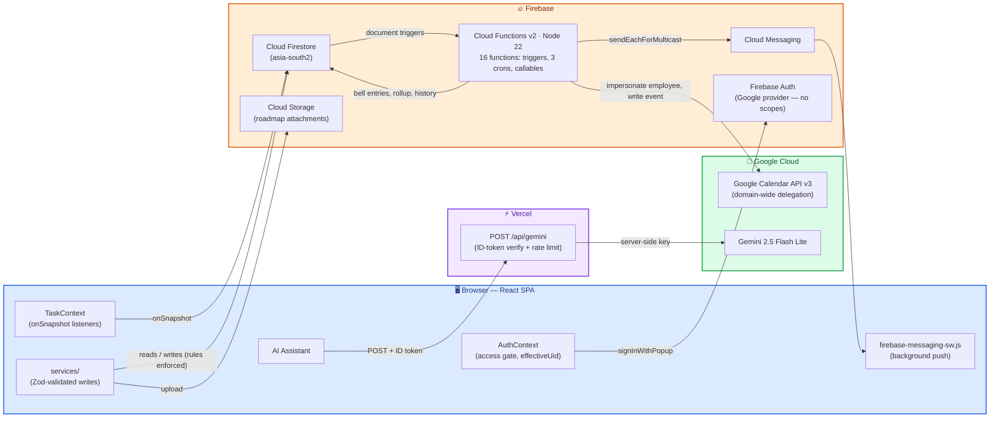

# AirBuddy Aerospace WorkSpace

A role-based **workforce platform** for the `@airbuddy.in` team — tasks and
collaboration, a company roadmap, HRMS, KPI tracking, an AI assistant, push
notifications and automatic Google Calendar sync.

React 19 + Vite SPA on Vercel, Firebase (Auth / Firestore / Storage / Messaging /
Functions) as the backend, Gemini for the assistant.

---

## Table of Contents

- [Overview](#overview)
- [Tech Stack](#tech-stack)
- [Routes and Access](#routes-and-access)
- [Features](#features)
- [Project Structure](#project-structure)
- [Architecture](#architecture)
- [Layering and Service Conventions](#layering-and-service-conventions)
- [Firestore Data Model](#firestore-data-model)
- [Composite Indexes](#composite-indexes)
- [Security Model](#security-model)
- [Cloud Functions](#cloud-functions)
- [Google Calendar Sync](#google-calendar-sync)
- [Notifications](#notifications)
- [Environment Variables](#environment-variables)
- [Getting Started](#getting-started)
- [Testing](#testing)
- [Deployment](#deployment)
- [Available Scripts](#available-scripts)
- [UI Conventions](#ui-conventions)
- [Gotchas Worth Knowing](#gotchas-worth-knowing)

---

## Overview

AirBuddy WorkSpace is a single-page application with **no server of our own in
the data path** — the browser talks to Firestore directly, and
[firestore.rules](firestore.rules) is the real authorization layer. Two thin
server tiers exist for the things a browser must not do: a Vercel serverless
function that holds the Gemini key, and Firebase Cloud Functions that own push
notifications, Google Calendar sync, the roadmap progress rollup and the audit
history.

| Tier | Runs where | Contents |
|---|---|---|
| [src/](src/) | Browser | The SPA. ESLint **blocks `firebase-admin` imports here** — it would bypass all security rules. |
| [api/](api/) | Vercel serverless | Only [api/gemini.js](api/gemini.js). |
| [functions/](functions/) | Firebase (CommonJS, Node 22) | 16 v2 functions — triggers, three crons, two callables. Blaze plan only. |
| `scripts/` | Local Node, Admin SDK | Gitignored one-off maintenance scripts. Needs `serviceAccountKey.json` at the repo root; run with `--dry-run` first. |

---

## Tech Stack

| Layer | Technology |
|---|---|
| **Frontend** | React 19, Vite 7, React Router v7 |
| **Styling** | Tailwind CSS 3 (fixed dark palette) |
| **Validation** | Zod 4 at every service write boundary |
| **Backend** | Firebase 12 — Auth, Firestore, Storage, Cloud Messaging |
| **Cloud Functions** | `firebase-functions` 7 (v2 API), `firebase-admin` 14, Node 22 |
| **Serverless API** | Vercel Functions (`/api/gemini`) |
| **AI** | Google Gemini 2.5 Flash Lite (`@google/genai`) |
| **Calendar** | Google Calendar API v3 — server-side, Workspace domain-wide delegation |
| **Charts** | Chart.js + react-chartjs-2 |
| **Calendar UI** | react-big-calendar (moment localizer) |
| **Markdown** | react-markdown + remark-gfm + rehype-slug (in-app docs) |
| **Dates** | date-fns |
| **Tests** | Vitest — 13 files, 368 tests |

---

## Routes and Access

Defined in [src/App.jsx](src/App.jsx). Providers are scoped to the route subtrees
that need them, so their Firestore listeners do not run app-wide.

```
BrowserRouter > AuthProvider > ViewModeProvider > Routes
  /login, /docs, /docs/:docId          (outside the app shell)
  ProtectedRoute > TaskProvider > AppLayout (Navbar + Sidebar + Outlet + AI button)
    /                     Dashboard
    /roadmap, /roadmap/:nodeId         (React.lazy + Suspense, RoadmapProvider)
    /calendar             Calendar + List view
    /work-partner         Collaboration drawer
    /team                 Team Members
    /announcements
    /about
    /hrms/leaves                       (employees see only their own)
    AdminRoute > /admin
    AdminRoute > /hrms/{directory,attendance,recruitment,performance}
    KpiProvider > /kpi, /kpi/{industries,clients,products,sales,ip}
```

The sidebar hiding a link is **not** access control — a new route needs both an
entry in `navItems` ([src/components/shared/Sidebar.jsx](src/components/shared/Sidebar.jsx))
and a guard in `App.jsx`.

### Authentication and identity

[src/context/AuthContext.jsx](src/context/AuthContext.jsx) is the source of three
things that touch everything:

1. **Access gate.** `@airbuddy.in` emails are auto-trusted. Every other email
   needs an `allowed_emails/{email}` document that is not suspended; otherwise
   the user is signed straight back out with a toast. The same logic is
   duplicated as `isEmailAllowed()` in `firestore.rules` — change both together,
   or the client and the rules will disagree.
2. **`effectiveUid`, never `user.uid`.** A secondary Google account can be mapped
   onto a primary user via `user_email_map/{email}.primaryUid`. All reads and
   writes key off `effectiveUid`; the rules mirror this with `getEffectiveUid()`,
   so a query on `user.uid` silently returns nothing for a mapped user and a
   write is rejected.
3. **`isAdmin` vs `realIsAdmin`.** Admins can toggle "employee view". `isAdmin`
   is the *effective* role that drives the UI, the route guards and the query
   shape; `realIsAdmin` is the actual role and only decides whether the toggle
   shows. Rules know nothing about the toggle — an admin in employee view still
   has admin write power at the database level.

**The browser holds no Google OAuth access token, and `googleProvider` must never
be given a scope.** See [Google Calendar Sync](#google-calendar-sync) for why.

---

## Features

### Dashboard

- Attendance **punch in / punch out** widget with a live clock.
- Time-filtered stats (Day / Week / Month, plus custom ranges — last 7d, 30d,
  90d, 6mo, 1yr): total, completed, pending, in progress.
- Donut, bar and line charts over the filtered window.
- Status tabs — All / In Progress / Pending / Completed — plus a filter bar and
  an admin-only employee picker.
- **Create Personal Task** modal for self-assigned work.
- Card or table layout, following the global view-mode toggle.

The list is `myWorkItems` from `TaskContext` — ordinary tasks **plus roadmap
milestones assigned to you**, which live in `roadmapNodes` and are projected into
task shape by `nodeToWorkItem()`.

### Admin Panel — 5 tabs

1. **Team Overview** — every member with task counts and completion rate.
2. **Assign Task** — create and assign to one or more employees. Cloud Functions
   then push-notify each assignee and put the task on their own Google Calendar.
   This tab also holds the **Sync now** button, which calls the
   `syncAllCalendars` callable to reconcile every calendar on demand.
3. **Task Monitor** — searchable, filterable table of all tasks, with delete.
4. **Announcements** — create/delete with priority and an optional meeting link.
5. **Employee Management** — all registered users, roles and join dates.

### Calendar

`react-big-calendar` with Month / Week / Day / Agenda views plus a **List View**
toggle. It draws three sources: tasks, approved leaves and roadmap milestones.
Events are colour-coded by priority; clicking one opens the task detail modal.

### Task detail modal

One modal serves both an ordinary task and a roadmap milestone
([src/components/Calendar/TaskDetailModal.jsx](src/components/Calendar/TaskDetailModal.jsx)):

- Full item detail, a 0–100 progress slider and a status control for assignees.
- **Todo checklist** with add / tick / inline edit / delete, stored in the item's
  `todos` array and mutated in a Firestore transaction so concurrent edits can't
  be lost. Open to admins, the creator, assignees and work partners; read-only
  for everyone else. Deliberately separate from the item's own progress value.
- **Work partners** — add or remove collaborators.
- **Collaboration timeline** — partner added, status changed, progress updated,
  and commit entries.
- **Extend** — push a due date out, leaving an "Extended" badge.
- Writes are routed by `_source`: a milestone's progress, status and completion
  go to `roadmapNodes/{id}` via `updateNodeAsAssignee`, and Delete is hidden for
  one — archiving is the correct operation, since a task-style delete would
  orphan the whole subtree.

### Work Partner

A dedicated page for partnered work, in card or table layout, with a per-task
drawer containing the timeline, a **git-style branch graph** of collaboration
events, commit posts with optional Drive links, and the same todo list.

Work partners are stored **twice** on the document: `workPartners` (rich objects,
what the UI renders) and `workPartnerUids` (a flat string array, the only thing
security rules can actually test — CEL cannot query into an array of maps). Both
are updated in the same `updateDoc` via `arrayUnion` / `arrayRemove`. Never
render `workPartnerUids`.

### Company Roadmap

A hierarchical planning module. Hierarchy is **materialized** on every node —
`parentId`, `path`, `ancestorIds[]`, `depth` — via `computeHierarchy()` rather
than derived ad hoc.

- **List view** — recursive expand/collapse, subscribing per node on expand and
  unsubscribing on collapse. Clicking a title opens the detail *and* expands the
  branch (expand only, never collapse, and never on a leaf).
- **Journey view** — a winding-path visualisation of a milestone's levels with a
  "You are here" marker.
- **Milestones are the unit of work.** The old `roadmapNodes/{id}/tasks`
  subcollection and its Tasks tab were removed; breaking a milestone down means
  adding child nodes. On the roadmap page a **root** milestone opens the
  right-hand detail panel (breadcrumb, comments, attachments, history, Add
  Child), while a **child** opens the ordinary task detail modal, because a child
  *is* the unit of work.
- **Detail panel — 4 tabs:** Overview, Comments, Attachments, History.
- **Attachments** — images, PDFs, Word docs, CSV/text, max 10 MB, in Firebase
  Storage under `roadmapAttachments/{nodeId}/`.
- **Audit history** — written only by Cloud Functions with the Admin SDK;
  `history` is `allow write: if false` for every client. History starts from the
  deploy forward and is not backfilled.
- **Progress rollup runs twice, on purpose** — client-side for instant feedback
  and in a Cloud Function authoritatively. Both are idempotent and walk the
  ancestor chain capped at 10 levels.
- **Sibling order is by `dueDate`**, tiebreaking `dueDate → order → title → id`.
  Undated nodes sink below every dated one, so a parent with no due date of its
  own lists alphabetically. (`order` is a dead field today — nothing writes it —
  but is still honoured so a future manual-ordering feature needs no change.)
- **KPI strip** — node counts by status and overall weighted progress.
- Read is open to every whitelisted user; structural writes are admin-only, with
  field-scoped carve-outs so an assignee can update their own milestone and a
  partner can tick a checklist item.
- Lazy-loaded into its own chunk (~79 kB, 19 kB gzip).

### HRMS

| Screen | Who | What |
|---|---|---|
| **Employee Directory** | Admin | Profile cards with view/edit modals and HR fields (department, designation, join date, base salary). |
| **Attendance** | Admin | Punch records per employee, 30-day and custom-range summaries. |
| **Leave Management** | Everyone | Employees apply (sick / casual / unpaid) and see only their own; admins review, approve or reject. An approved leave lands on the applicant's Google Calendar and fires a bell entry plus push. |
| **Recruitment** | Admin | Candidate pipeline board, starting at the Applied stage. |
| **Performance** | Admin | Reviews per period scoring communication, technical, leadership, teamwork and punctuality, plus goals assigned vs completed. |

### KPI

`KpiProvider` runs five Firestore listeners, scoped to `/kpi` routes only.
Panels: **Industries**, **Clients**, **Products**, **Sales** and **IP**
(`kpi_patents` doubles as general IP — Patent / Trademark / Software-Calculator;
`/kpi/patents` redirects to `/kpi/ip`). The dashboard shows counts and derived
progress.

**Progress percentages are derived, never stored** — they come from
`FILING_STAGE_PROGRESS` / `DEV_STAGE_PROGRESS` in
[src/context/KpiContext.jsx](src/context/KpiContext.jsx), so adding a stage means
editing the map, not Firestore.

### Announcements

Readable by every authenticated user, created and deleted by admins, with
priority levels and an optional meeting link. Read receipts live in an `isRead`
array that any user may append to. Posting one pushes to every registered device
and drops a 15-minute Calendar entry on the whole team.

### AI assistant

A floating chat widget
([src/components/AIAssistant/AIAssistantButton.jsx](src/components/AIAssistant/AIAssistantButton.jsx))
→ [src/services/gemini.js](src/services/gemini.js) → `POST /api/gemini`. The
client injects the user's task summary into the system prompt and attaches a
fresh Firebase ID token. [api/gemini.js](api/gemini.js) verifies that token with
the Admin SDK, applies a **30 requests/minute per-UID** in-memory rate limit,
restricts CORS to a single origin, caps message length and the last 20 history
turns, then calls Gemini. Without `FIREBASE_SERVICE_ACCOUNT` it returns **503**
rather than serving unauthenticated traffic — so a local `/api/gemini` will 503
until that variable is set. The assistant is intentionally read-only and points
users at the UI for changes.

### In-app documentation

[src/docs/](src/docs/) markdown rendered at `/docs` via
[src/docs/config.js](src/docs/config.js): Getting Started, Platform Features,
Company Roadmap, Architecture, API Reference and Deployment Guide. User-facing
feature changes belong there as well as here.

---

## Project Structure

```
Work_flow/
├── api/
│   └── gemini.js                   # Vercel function — auth + rate limit + Gemini proxy
│
├── functions/                      # Firebase Cloud Functions (v2, CommonJS, Node 22)
│   ├── index.js                    # Task/announcement/leave/node triggers, crons, callables
│   ├── adminApp.js                 # The single initializeApp() — exports db, FieldValue, messaging
│   ├── fcm.js                      # Token lookup, batched send, dead-token pruning, APP_URL
│   ├── notify.js                   # notifyUsers() — bell entry + push together
│   ├── calendar.js                 # Google Calendar sync (JWT impersonation, reconcile, backfill)
│   ├── calendarEvent.js            # Pure event builders (no firebase-admin, unit-tested)
│   ├── time.js                     # IST day boundaries
│   ├── roadmapTriggers.js          # Progress rollup + audit history
│   ├── roadmapDeadlineCheck.js     # Roadmap due/overdue cron
│   └── roadmapService.server.js    # Pure rollup math (unit-tested from src/)
│
├── public/
│   └── firebase-messaging-sw.js    # FCM service worker — required at this exact path
│
├── src/
│   ├── main.jsx                    # Entry point
│   ├── App.jsx                     # Router, ProtectedRoute / AdminRoute, provider scoping
│   │
│   ├── context/
│   │   ├── AuthContext.jsx         # Access gate, effectiveUid, isAdmin/realIsAdmin
│   │   ├── TaskContext.jsx         # Task + assigned-milestone listeners, myWorkItems
│   │   ├── ViewModeContext.jsx     # Global card/table toggle, persisted to the profile
│   │   ├── KpiContext.jsx          # Five KPI listeners, scoped to /kpi
│   │   └── RoadmapContext.jsx      # Root milestone listener, scoped to /roadmap
│   │
│   ├── services/                   # The only layer that talks to Firestore
│   │   ├── firebase.js             # App init — auth, db, storage, googleProvider (no scopes!)
│   │   ├── taskService.js          # Task CRUD, admin listener, syncAllCalendars callable
│   │   ├── collaborationService.js # Work partners, timeline events, commits
│   │   ├── todoService.js          # Transactional checklist CRUD
│   │   ├── roadmapService.js       # Nodes, hierarchy, rollup, assigned-node projection
│   │   ├── roadmapTaskService.js   # Legacy roadmap tasks + Phase 23 mirror write
│   │   ├── roadmapCommentService.js · roadmapAttachmentService.js · roadmapHistoryService.js
│   │   ├── hrmsService.js          # Employees, attendance, leaves, candidates, reviews
│   │   ├── kpiService.js           # Industries, clients, products, sales, IP
│   │   ├── announcementService.js · teamMembersService.js
│   │   ├── notificationService.js  # Bell writes + browser notification permission
│   │   ├── pushService.js          # FCM permission, SW registration, token storage
│   │   └── gemini.js               # Calls /api/gemini
│   │
│   ├── hooks/                      # useNotifications, useTaskTodos, useTaskTimeline,
│   │                               # useTaskFilters, useTeamMembers, useRoadmapTree,
│   │                               # useRoadmapNode, useRoadmapKpi, useRoadmapCalendarEvents
│   ├── utils/
│   │   ├── permissions.js          # canEditTask, canManageTodos, MODULE_OPTIONS, …
│   │   ├── dateHelpers.js          # toDate, toLocalDateString, formatDate, due-date labels
│   │   └── workItemRef.js          # Resolves tasks/ vs roadmapNodes/ for shared services
│   │
│   ├── pages/                      # AppLayout, LoginPage, DocsPage
│   ├── docs/                       # In-app markdown documentation + config.js
│   └── components/
│       ├── Dashboard/              # EmployeeDashboard, SelfTaskModal, TaskFilterBar
│       ├── Admin/AdminPanel.jsx
│       ├── Calendar/               # CalendarView, ListView, TaskDetailModal
│       ├── Roadmap/                # Tree, node cards, Journey view, detail panel, tabs
│       ├── WorkPartner/            # WorkPartner, TaskTimeline, GitBranchGraph, selectors
│       ├── HRMS/                   # Directory, Attendance, Recruitment, Performance
│       ├── KPI/                    # Dashboard, five panels, modals, RoadmapKpiStrip
│       ├── Announcement/ · About/ · AIAssistant/
│       └── shared/                 # Navbar, Sidebar, Modal, TaskCard, TaskTodoList, Charts
│
├── firestore.rules                 # ~600 lines — the real authorization layer
├── firestore.indexes.json          # 8 composite indexes + 2 field overrides (read the warning)
├── storage.rules                   # Roadmap attachments only; everything else closed
├── firebase.json · .firebaserc     # Project alias `work` → workspace-airbuddy
├── vercel.json                     # SPA rewrite + /api routing
├── vite.config.js                  # Hand-partitioned vendor chunks
└── tailwind.config.js              # Design tokens
```

---

## Architecture


```mermaid
graph LR
    subgraph FE ["🖥️ Browser — React SPA"]
        direction TB
        AuthContext["AuthContext\n(access gate, effectiveUid)"]
        TaskContext["TaskContext\n(onSnapshot listeners)"]
        Services["services/\n(Zod-validated writes)"]
        AIAssistant["AI Assistant"]
        SW["firebase-messaging-sw.js\n(background push)"]
    end

    subgraph VERCEL ["⚡ Vercel"]
        VercelFunc["POST /api/gemini\n(ID-token verify + rate limit)"]
    end

    subgraph GCLOUD ["🤖 Google Cloud"]
        GeminiAPI["Gemini 2.5 Flash Lite"]
        GCalAPI["Google Calendar API v3\n(domain-wide delegation)"]
    end

    subgraph FIREBASE ["🔥 Firebase"]
        direction TB
        FirebaseAuth["Firebase Auth\n(Google provider — no scopes)"]
        Firestore["Cloud Firestore\n(asia-south2)"]
        Storage["Cloud Storage\n(roadmap attachments)"]
        FCM["Cloud Messaging"]
        CloudFunctions["Cloud Functions v2 · Node 22\n16 functions: triggers, 3 crons, callables"]
    end

    AuthContext -->|"signInWithPopup"| FirebaseAuth
    TaskContext -->|"onSnapshot"| Firestore
    Services -->|"reads / writes (rules enforced)"| Firestore
    Services -->|"upload"| Storage
    AIAssistant -->|"POST + ID token"| VercelFunc
    VercelFunc -->|"server-side key"| GeminiAPI

    Firestore -->|"document triggers"| CloudFunctions
    CloudFunctions -->|"sendEachForMulticast"| FCM
    CloudFunctions -->|"impersonate employee, write event"| GCalAPI
    CloudFunctions -->|"bell entries, rollup, history"| Firestore
    FCM --> SW

    classDef feStyle fill:#dbeafe,stroke:#2563eb,stroke-width:2px,color:#1e3a8a
    classDef vercelStyle fill:#f3e8ff,stroke:#7c3aed,stroke-width:2px,color:#4c1d95
    classDef gcStyle fill:#dcfce7,stroke:#16a34a,stroke-width:2px,color:#14532d
    classDef fbStyle fill:#ffedd5,stroke:#ea580c,stroke-width:2px,color:#7c2d12

    class FE feStyle
    class VERCEL vercelStyle
    class GCLOUD gcStyle
    class FIREBASE fbStyle
```

Note that **the browser never calls the Calendar API** — that arrow runs from
Cloud Functions only, and deliberately so.

---

## Layering and Service Conventions

Inside `src/` the layering is components → `hooks/` → `services/` → Firestore.
Components should not import `firebase/firestore` directly; add a function to the
relevant service instead. Every file in [src/services/](src/services/) follows
the same contract:

- **Zod validation at every write boundary** — `Schema.parse(form)` before the
  write, so a bad shape throws before it reaches Firestore.
- `serverTimestamp()` for `createdAt` / `updatedAt` — never `new Date()`.
- **No `orderBy()` in queries; sort client-side in the subscribe callback.** This
  is deliberate, to avoid needing a composite index per query. The exceptions are
  the paths that do have indexes: roadmap queries, `notifications`, admin `tasks`.
- `subscribeToX(onData, onError)` returns the unsubscribe function; providers and
  hooks return it from `useEffect`.
- Errors: `console.error('[serviceName] functionName:', err)` then re-throw.

`TaskContext` runs one broad listener for admins (`orderBy('createdAt','desc')`)
and three narrower ones for employees — assigned, work-partner and
roadmap-assigned — into **separate state slices** merged in a `useMemo`. Keeping
them separate avoids `clear()` races between snapshot callbacks; do not collapse
them back into one shared mutable map.

Shared services resolve their collection through
[src/utils/workItemRef.js](src/utils/workItemRef.js) instead of hardcoding
`tasks`. `todoService` and `collaborationService` take the **work item object**,
not a bare id, and `workItemCollection()` maps `_source: 'roadmapNode'` onto
`roadmapNodes` — which is how one detail modal drives both. `useTaskTodos` and
`useTaskTimeline` therefore key their effect on a derived `collection/id`
**string**, never on the object, or the snapshot listener would be torn down and
rebuilt on every render.

---

## Firestore Data Model

### Identity and access

| Path | Write access | Notes |
|---|---|---|
| `users/{uid}` | Self (safe fields) / admin | Self-update **denies** `role, uid, email, salaryBase, department, designation` and the three FCM keys. Create must be `role: 'employee'` and is blocked for mapped secondary emails. |
| `users/{uid}.fcmToken(s)` | Self, own branch only | `fcmToken`, `fcmTokens`, `fcmTokenUpdatedAt` have a **separate** update branch guarded by `hasOnly` — a write touching anything else alongside them is rejected. |
| `allowed_emails/{email}` | Admin | External-collaborator whitelist. Read is restricted to your own email (anti-enumeration). |
| `user_email_map/{email}` | Admin | Secondary email → `primaryUid`. Same read restriction. |

**`users/{uid}`** — `uid`, `name`, `email`, `role` (`employee` | `admin`),
`avatar`, `viewMode` (`card` | `table`), `department`, `designation`, `joinDate`,
`salaryBase`, `fcmToken`, `fcmTokens[]`, `fcmTokenUpdatedAt`, `createdAt`.

### Work

**`tasks/{taskId}`** — `title`, `description`, `module`, `priority`
(`low`/`medium`/`high`), `status` (`pending`/`in-progress`/`completed`),
`progress` (0–100), `startDate`, `dueDate`, `assignedTo[]`, `assignedBy`,
`createdBy`, `isAdminTask`, `links[]`, `attachments[]`, `todos[]`,
`workPartners[]`, `workPartnerUids[]`, `isExtended`, `completionNote`,
`calendarEventIds` (`{ uid: eventId }`, written by the Admin SDK), `createdAt`,
`updatedAt`.

> **Task update rules are field-scoped.** An assignee may write anything *except*
> `title, description, assignedTo, startDate, priority, module, isAdminTask`; any
> participant may write *only* `workPartners, workPartnerUids, updatedAt`. When
> you add a field to a task, decide which bucket it belongs in — otherwise the
> write is rejected in production but passes locally against an admin account.

**`tasks/{taskId}/events/{id}`** — the collaboration timeline: `partner_added`,
`status_changed`, `progress_updated`, `commit`. `authorUid` must equal
`getEffectiveUid()`.

**`roadmapNodes/{id}`** — `title`, `description`, `status`
(`pending`/`in-progress`/`completed`/`blocked`/`archived`), `priority`
(`low`/`medium`/`high`/`critical`), `startDate`, `dueDate`, `assignedTo[]`,
`createdBy`, `updatedBy`, `parentId`, `path`, `ancestorIds[]`, `depth`, `order`,
`progress`, `childCount`, `childCompletedCount`, `dependencies[]`, `tags[]`,
`isArchived`, plus the shared work-item fields (`todos`, `workPartners`,
`workPartnerUids`, `attachments`, `isExtended`, `completionNote`).
Subcollections: `tasks` (legacy), `events`, `comments`, `history` (function-write
only), `attachments`.

**`announcements/{id}`** — `title`, `message`, `priority`
(`normal`/`medium`/`high`), `targetAudience`, `meetingLink`, `adminId`,
`adminName`, `adminAvatar`, `isRead[]`, `createdAt`.

**`notifications/{uid}/items/{id}`** — `title`, `message`, `type`, `read`,
`senderUid`, `eventLink`, `createdAt`.

### HRMS

| Path | Shape |
|---|---|
| `leaves/{id}` | `uid`, `applicantName`, `type` (`sick`/`casual`/`unpaid`), `startDate`, `endDate` (`YYYY-MM-DD`), `reason`, `status` (`pending`/`approved`/`rejected`), `reviewedBy`, `createdAt`, `updatedAt` |
| `attendance/{uid}/records/{id}` | `date` (`YYYY-MM-DD`, **local** not UTC), `punchIn`, `punchOut`, `createdAt`, `updatedAt` — owner-write only; admins read all |
| `candidates/{id}` | `name`, `email`, `role`, `experience`, `resumeUrl`, `notes`, `status` (starts at `Applied`), `createdAt`, `updatedAt` |
| `performances/{id}` | `uid`, `employeeName`, `reviewedBy`, `period`, `skills: { communication, technical, leadership, teamwork, punctuality }`, `goalsAssigned`, `goalsCompleted`, `notes`, `createdAt` |

### KPI — admin write, all read

| Collection | Shape |
|---|---|
| `kpi_industries` | `name`, `status`, `growthPercent` |
| `kpi_clients` | `name`, `industryId`, `currentStatus`, `progressPercent` |
| `kpi_products` | `name`, `type`, `devCompleted`, `stage` (Design / Testing / Iteration / Design Freeze), `industryIds[]` |
| `kpi_sales` | `productId`, `clientId`, `unitsSold`, `salesProgressPercent`, `launched`, `type` (B2B Sale / Paid Pilot) |
| `kpi_patents` | `ipType` (Patent / Trademark / Software-Calculator), `title`, `filingStage`, `appNumber`, `fieldOfInvention`, `trademarkClass`, `toolName`, `status`, `repoOrToolLink` |

---

## Composite Indexes

Eight composite indexes live in [firestore.indexes.json](firestore.indexes.json),
mostly roadmap queries (`parentId+isArchived+order`, `ancestorIds`
array-contains, collection-group `tasks` and `history`). A new roadmap query
almost certainly needs an entry there.

> ⚠️ **`fieldOverrides` in that file is destructive.** `firebase deploy --only
> firestore:indexes` treats the array as the *complete* set of single-field
> overrides for the project: anything live but absent from the file is
> **deleted**. Adding one entry therefore silently drops every other field's
> exemption. That is exactly how it went wrong once — adding a `tasks.dueDate`
> override removed the `tasks.assignedTo` `COLLECTION_GROUP`/`CONTAINS`
> exemption, and the collection-group listener in `TaskContext` started failing
> with `failed-precondition` in production. Before editing the array, list what
> is actually live (`npx firebase-tools firestore:indexes`) and restate all of it.

Two related traps in the same area:

- A **composite** index does not serve a single-field `array-contains` query.
  Index 5 (`assignedTo + status`) looks like it covers the `assignedTo`-only
  listener; it does not — that needs its own `CONTAINS` single-field index.
- Automatic single-field indexes are **`COLLECTION`-scoped only**. Any
  `collectionGroup()` query filtering on a single field needs an explicit
  `COLLECTION_GROUP` entry, and declaring one replaces the automatic `COLLECTION`
  ones, so restate those too.

The symptom is `The query requires a COLLECTION_GROUP_CONTAINS index` in the
browser console — quiet enough to survive a casual look, because the listener
degrades gracefully and only the affected items go missing.

---

## Security Model

[firestore.rules](firestore.rules) is the only real authorization layer;
[src/utils/permissions.js](src/utils/permissions.js) merely gates UI affordances.
**Granting a capability means editing both.** The client helpers check
`userProfile.role` directly rather than `isAdmin` from context — intentionally,
for consistency across helpers.

| Collection | Rule summary |
|---|---|
| `users` | Read: any whitelisted user. Create: own profile, `employee` role only, blocked for mapped secondary emails. Update: self (minus the denied fields) or admin, with a separate `hasOnly` branch for FCM tokens. Delete: admin. |
| `allowed_emails`, `user_email_map` | Read only your own email; write admin-only. |
| `tasks` | Admin: all. Employee: read what they are assigned to, created, or partner on; create personal tasks (`isAdminTask: false`); update within the field-scoped buckets above; delete only their own personal tasks. |
| `tasks/{id}/events` | Participants only; `authorUid` must equal `getEffectiveUid()`. |
| `announcements` | All read; anyone may append to `isRead`; admin create/delete. |
| `notifications/{uid}/items` | Create is heavily constrained: `senderUid` **must** equal `getEffectiveUid()`, `read` must be `false`, `type` must be one of fourteen enum values, `title` ≤ 200 and `message` ≤ 500 chars. Only the owner can read, update or delete. |
| `leaves`, `attendance`, `candidates`, `performances` | Owner-or-admin patterns. Attendance records are owner-write only; admins read all and may delete. |
| `kpi_*` | All read, admin write. |
| `roadmapNodes` | Read: all whitelisted. Structural write: admin. Non-admin carve-outs: the rollup fields (`progress, childCompletedCount, status, updatedAt`), an **assignee** carve-out matching `NODE_ASSIGNEE_WRITABLE_FIELDS` exactly, and a **participant** carve-out for the shared arrays (`workPartners, workPartnerUids, todos`) so a partner can tick a checklist item without gaining the right to set progress. |
| `roadmapNodes/{id}/history` | `allow write: if false` — Cloud Functions only. Do not "fix" an empty log by writing history from the client; that would mean weakening the audit-trail rule. |
| Storage `roadmapAttachments/{nodeId}/{file}` | Signed-in read/write, 10 MB cap, matching the Firestore metadata check. Everything else in the bucket is closed. |

`hasOnly()` fails the **whole** update for one stray key — which is why
`updateNodeAsAssignee` writes nothing outside `NODE_ASSIGNEE_WRITABLE_FIELDS`.
Keep that constant and the rule's list identical.

Passing the wrong `senderUid` — or omitting it — is the usual cause of a
silently rejected notification. The two crons write bell entries with
`senderUid: 'system'`, which is legal only because the Admin SDK bypasses rules
entirely.

`firestore.rules.roadmap.draft` at the repo root is a superseded draft. The live
rules are in `firestore.rules`; don't edit the draft.

---

## Cloud Functions

Sixteen functions, all **v2** (`firebase-functions` 7, whose root export *is* the
v2 namespace — `functions.firestore.document` and `functions.pubsub.schedule` do
not exist there). Runtime Node 22, `maxInstances: 10`, 256 MiB, set once via
`setGlobalOptions` in [functions/index.js](functions/index.js).

| Function | Trigger | Does |
|---|---|---|
| `onTaskCreate` | `tasks/{id}` created | Push to assignees (skips the creator) + one Calendar event per assignee and partner |
| `onTaskUpdate` | `tasks/{id}` updated | Bell + push on a status change **or a reschedule**; skips `updatedBy`. Calendar sync runs before those guards, so a retitle moves the event too |
| `onTaskDelete` | `tasks/{id}` deleted | Removes the task's events from every calendar |
| `onAnnouncementCreate` | `announcements/{id}` created | Push to every device + a timed Calendar entry for the team |
| `onAnnouncementDelete` | `announcements/{id}` deleted | Removes those entries |
| `onRoadmapNodeCalendar` | `roadmapNodes/{n}` written | Milestone Calendar events, plus bell + push for newly added assignees |
| `onLeaveCalendar` | `leaves/{id}` written | Approved leave on the applicant's calendar, plus bell + push on approval or rejection |
| `onRoadmapTaskWrite` | `roadmapNodes/{n}/tasks/{t}` written | Node progress rollup (transaction) |
| `onRoadmapNodeProgressChange` | `roadmapNodes/{n}` written | Ancestor progress propagation |
| `onRoadmapNodeHistory` / `onRoadmapTaskHistory` | same paths | Audit-history writes |
| `onDueDateApproach` | cron **09:00 IST** | Bell + push for root tasks due tomorrow |
| `roadmapDeadlineCheck` | cron **09:15 IST** | Bell + push for roadmap tasks due tomorrow or overdue |
| `dailyCalendarReconcile` | cron **07:30 IST** | Creates any missing Calendar event — the backfill, run daily |
| `syncAllCalendars` | callable, admin-only | The same reconcile on demand, behind the Admin Panel's **Sync now** button |
| `askGemini` | callable | Unused by the SPA (which calls `/api/gemini`); kept as a non-Vercel fallback |

### The region split is deliberate — do not tidy it into one region

| | Region | Why |
|---|---|---|
| The 11 triggers + `askGemini` + `syncAllCalendars` | `asia-south2` (Delhi) | The Firestore database lives there. A Firestore trigger creates its Eventarc trigger in the *database's* region no matter where the function runs, so anything else means a cross-region hop plus egress on every document the rollup and history triggers read. |
| `onDueDateApproach`, `roadmapDeadlineCheck`, `dailyCalendarReconcile` | `asia-south1` (Mumbai) | **Cloud Scheduler has no `asia-south2` presence** — deploying a scheduled function there fails with `Location 'asia-south2' is not a valid location`. The cross-region reads are irrelevant for a once-a-day scan. |

Shared modules are required rather than duplicated:
[functions/adminApp.js](functions/adminApp.js) holds the **single**
`initializeApp()` call and re-exports `db`, `FieldValue`, `Timestamp` and
`getMessaging`; [functions/fcm.js](functions/fcm.js) owns token lookup, batched
`sendEachForMulticast` and automatic pruning of dead tokens;
[functions/notify.js](functions/notify.js) is the single entry point that writes
the bell entry and sends the push together; [functions/time.js](functions/time.js)
owns IST day boundaries.

**No legacy `admin` namespace anywhere in `functions/`.** `firebase-admin` 14
removed it — `require('firebase-admin')` still resolves but `admin.apps`,
`admin.firestore` and `admin.messaging` are all `undefined`. A single
`admin.apps.length` throws at module load and the deploy then fails with the
unhelpful *"User code failed to load. Cannot determine backend specification"*,
with the real TypeError a few lines above it. Always import from
`firebase-admin/app`, `firebase-admin/firestore`, `firebase-admin/messaging`.

**Why `time.js` exists.** Function containers run on a UTC clock but the company
is on IST, so `new Date().getDate()` inside a function is the *previous* calendar
day for ~5.5 hours every night. `dueDate` is written client-side as UTC midnight
of the picked day, so the correct query boundary is "UTC midnight of the
**Indian** calendar day" — `istTodayUtcMidnight()`. Do not reach for
`new Date()` arithmetic in a scheduled function.

Two cost guards worth knowing before changing a query: `roadmapDeadlineCheck`'s
overdue scan is bounded to 30 days (without a lower bound it re-reads and
re-notifies about every task that has ever slipped, every day), and
`onDueDateApproach` filters `status !== 'completed'` **in memory** rather than in
the query, because combining that with a `dueDate` range would mean two
inequality fields, needing another composite index and an `orderBy`.

The pure rollup math in `functions/roadmapService.server.js` is unit-tested from
`src/` via `createRequire` — keep it dependency-free so that keeps working.

---

## Google Calendar Sync

Everything the app notifies people about, and everything on its own Calendar
page, also lands on the relevant person's Google Calendar —
[functions/calendar.js](functions/calendar.js) plus the pure half in
[functions/calendarEvent.js](functions/calendarEvent.js). **There is no client
involvement at all**: no button, no scope, no popup, no `gapi`.

### Why it is server-side, and why that is not negotiable

The browser version was built first and rolled back.
`googleProvider.addScope('.../auth/calendar')` puts a **sensitive** scope into
the `signInWithPopup()` request, and because this OAuth app is not verified by
Google, every team member's *login* was interrupted by a full-page "Google hasn't
verified this app" / "Access blocked" warning. On top of that, a browser token
can only write to the calendar of whoever is signed in — so assigning work to
somebody else put it on the *admin's* calendar.

The standing requirement is that signing out and back in shows no Google warning
whatsoever, so **never put a scope back on `googleProvider`.** The comment in
[src/services/firebase.js](src/services/firebase.js) says the same at the call
site.

### How impersonation works

A service account holds Workspace **domain-wide delegation** for
`https://www.googleapis.com/auth/calendar.events` (least privilege — it can write
events but cannot create or delete calendars), authorised once by the super admin
in admin.google.com → Security → Access and data control → API controls → Domain
wide delegation. `calendar.js` builds a JWT with
`subject: '<employee>@airbuddy.in'` and writes to that person's `primary`
calendar. The consent is org-level, so individual employees are never prompted
and sync works with their browser closed. The service-account JSON lives in the
`CALENDAR_SA_KEY` secret.

### What syncs, and to whom

| Record | Goes to | Trigger |
|---|---|---|
| `tasks/{id}` | assignees **and work partners** | `onTaskCreate` / `onTaskUpdate` / `onTaskDelete` |
| `roadmapNodes/{id}` | the milestone's `assignedTo` | `onRoadmapNodeCalendar` |
| `leaves/{id}` | the applicant, once `status == 'approved'` | `onLeaveCalendar` |
| `announcements/{id}` | every Workspace account | `onAnnouncementCreate` / `onAnnouncementDelete` |

Work partners are included because a partnered task already shows on their
Dashboard — the calendar was the one place the work was invisible to them. Only
the leave *applicant* gets a leave event: admins see everybody's leave on the
app's Calendar page, but mirroring the whole team's time off into an admin's
personal calendar would bury their own days. Milestones with no assignee, and
nodes that are archived or undated, sync to nobody.

The two deadline crons deliberately create **no** calendar entries — the event
for the task already carries reminders a day and an hour ahead.

### Things worth knowing before changing any of it

- **Triggers only fire on writes, so a backfill is mandatory.** Anything created
  before the feature was deployed has no event and never would — on day one the
  entire backlog was invisible in everybody's calendar while new tasks synced
  correctly, which read as "the feature does not work". `backfillAll()` walks
  current state and creates only what is missing; `dailyCalendarReconcile` runs
  it every morning at 07:30 IST (before the 09:00 reminder wave) and
  `syncAllCalendars` exposes it to the Admin Panel. It is idempotent and bounded
  to 60 days of lookback. Running it daily also heals a failed API call, a lost
  roadmap mirror write, and an event somebody deleted by hand.
- **Only `@airbuddy.in` accounts sync.** Delegation cannot impersonate an
  external `allowed_emails` collaborator or a gmail account, so those are skipped
  with a log line. Roughly half the team is on gmail today; this is not a bug to
  fix in code — either those people get Workspace accounts, or the sync falls
  back to attendee invitations for them.
- **`calendarEventIds: { uid: eventId }`** on the record is how an edit or delete
  finds the right event in each person's calendar. It is written with the Admin
  SDK, so the rules need no entry for it.
- **That write-back re-fires the same trigger, so the anti-loop guard matters.**
  `fieldsChanged(before, after, fields)` only reports a change for the entity's
  own field list (`SYNCED_FIELDS`, `NODE_SYNCED_FIELDS`, `LEAVE_SYNCED_FIELDS`);
  `calendarEventIds` is deliberately in none of them. Add it and the trigger
  loops. Timestamps are compared by value and arrays element-wise, because two
  `Timestamp` objects for the same instant are never `===` and `assignedTo` is a
  fresh array on every snapshot.
- **`progress` is not in `NODE_SYNCED_FIELDS`, and must not be** — the rollup
  rewrites it on every tick anywhere below a node. The event shows `status`
  instead, and carries no progress percentage, which would be permanently stale.
- **Node and leave sync are `onDocumentWritten`, not create/update/delete**,
  because eligibility there is a *state*, not an event. One reconciling handler
  per write is simpler than three that have to agree.
- **All-day `end.date` is exclusive.** A task due on the 20th needs `end.date` =
  the 21st, or Google renders it as ending on the 19th.
- **All-day reminder offsets are counted from midnight**, so the obvious-looking
  `{ minutes: 60 }` fires at 23:00 the night before and `{ minutes: 1440 }` at
  midnight — both while everyone is asleep, which is why the first version felt
  silent even though reminders were set. The offsets are `900`, `2340` and
  `5220`, all landing at 09:00 IST. Do not "tidy" them into round day multiples —
  [src/services/calendarReminders.server.test.js](src/services/calendarReminders.server.test.js)
  asserts `minutes % 1440 === 900` precisely so that tidying fails the build.
- **Every event carries an `email` reminder as well as popups** — email is the one
  channel that still arrives when a user has denied browser notifications and has
  the app closed.
- **The announcement event is timed, not all-day** — a 15-minute slot at the
  moment of posting with a 0-minute popup and email, so the reminder fires
  immediately. It is also `transparency: 'transparent'`, so it marks nobody busy.
- **A leave event has no reminders at all**, deliberately: a day off is not a
  to-do. The approval is what needs announcing, and that is a bell entry plus push.
- **Dates go through `istDateString()`**, for the same reason the client uses
  `toLocalDateString()`.
- **Nothing here can fail a task write.** Every entry point wraps its work in
  try/catch and logs; a broken or unset secret degrades to "no calendar events",
  and a missing delegation is reported with a one-line hint naming the console
  page and the scope to add.

---

## Notifications

**Three channels, none redundant:** the bell is what a user with the app open
sees, push is what reaches a user whose tab is closed, and the Google Calendar
reminder is what fires later at 09:00 IST.

[functions/notify.js](functions/notify.js) is the single server-side entry
point — `notifyUsers(uids, { title, body, type })` writes the bell entries and
sends the push together, so the two cannot drift. Before it existed, each cron
wrote its own bell document inline, and three things happened **completely
silently**: a task being rescheduled, a leave being approved or rejected, and
somebody being put on a roadmap milestone.

**In-app (client-written)** — `notifications/{uid}/items`, written by
[src/services/notificationService.js](src/services/notificationService.js), read
by the Navbar bell, plus a foreground browser `Notification` for the acting
user's own session.

**Background push (FCM)** — four pieces, and it only works when all four line up:

1. [public/firebase-messaging-sw.js](public/firebase-messaging-sw.js), at exactly
   that origin path. A service worker cannot read `import.meta.env` and Vite
   copies `public/` verbatim, so the Firebase config is passed **through the
   registration URL's query string** and read back off `self.location`. Bump
   `SW_VERSION` in `pushService.js` to force a re-install.
2. [src/services/pushService.js](src/services/pushService.js) — `isSupported()`
   feature detection (not a bare `getMessaging()` in a try/catch, which does not
   reliably throw), permission prompt, SW registration,
   `getToken({ vapidKey, serviceWorkerRegistration })`, and the Firestore write.
   `AuthContext` calls `enablePushNotifications()` on login and
   `disablePushNotifications()` on sign-out, so a shared machine stops receiving
   the previous user's push.
3. `users/{uid}.fcmTokens` (array, multi-device) plus `fcmToken` (latest, read as
   a fallback for older documents).
4. `VITE_FIREBASE_VAPID_KEY` in `.env` **and in Vercel**. Missing it makes
   `enablePushNotifications` return `no-vapid-key` and fall back to
   foreground-only notifications.

Dead tokens are pruned automatically after a
`registration-token-not-registered` response, so `fcmTokens` does not accumulate
dead devices. Browsers without web push (Safari < 16.4, most in-app browsers)
fall back to foreground-only.

**A new notification type has to be added in three places** — the enum in
[firestore.rules](firestore.rules), `NOTIF_TYPES` in `functions/notify.js`, and
`NOTIF_ICON_MAP` in [src/components/shared/Navbar.jsx](src/components/shared/Navbar.jsx)
(a missing icon silently falls back to a grey circle). The current fourteen:
`task_assigned`, `task_updated`, `task_completed`, `task_rescheduled`,
`announcement`, `partner_added`, `general`, `leave_status`,
`roadmap_task_assigned`, `roadmap_node_assigned`, `roadmap_milestone_completed`,
`roadmap_deadline_tomorrow`, `roadmap_deadline_missed`, `roadmap_comment_posted`.
`SERVER_NOTIF_TYPES` in `notificationService.js` documents the three only the
server writes.

---

## Environment Variables

### Frontend — `.env` at the repo root (gitignored)

```env
VITE_FIREBASE_API_KEY=
VITE_FIREBASE_AUTH_DOMAIN=
VITE_FIREBASE_PROJECT_ID=workspace-airbuddy
VITE_FIREBASE_STORAGE_BUCKET=
VITE_FIREBASE_MESSAGING_SENDER_ID=
VITE_FIREBASE_APP_ID=
VITE_FIREBASE_MEASUREMENT_ID=
VITE_FIREBASE_VAPID_KEY=        # required for background push

FIREBASE_SERVICE_ACCOUNT=       # JSON string — used by the local /api/gemini function
```

> **Every `VITE_*` value must also exist in the Vercel project settings.** The
> browser bundle is built there, so a key that is only in the local `.env` works
> in `npm run dev` and silently disables the feature in production.

> `VITE_GOOGLE_CLIENT_ID` and `VITE_GOOGLE_CALENDAR_API_KEY` are **dead** —
> nothing in `src/` reads them since Calendar sync moved server-side, and they
> can be deleted from `.env` and from Vercel. Calendar needs nothing in the
> browser, and a Calendar OAuth scope must never be added to `googleProvider`.

### Vercel — project dashboard

```env
GEMINI_API_KEY=            # Google AI Studio key, server-side only
FIREBASE_SERVICE_ACCOUNT=  # Admin SDK JSON — without it /api/gemini returns 503
ALLOWED_ORIGIN=            # optional; defaults to https://airbuddy-workspace.vercel.app
```

### Cloud Functions — secrets, not `functions.config()`

`functions.config()` was removed in `firebase-functions` v7 and no longer works.

```powershell
npx firebase-tools functions:secrets:set GEMINI_API_KEY
npx firebase-tools functions:secrets:set CALENDAR_SA_KEY   # service-account JSON for Calendar
```

`APP_URL` — the push and calendar click target — is a `defineString` parameter
and is prompted for on the first deploy.

---

## Getting Started

### Prerequisites

- **Node.js 20+** and npm (the Functions runtime is Node 22 — match it locally if
  you plan to deploy).
- A Google account with access to the Firebase project `workspace-airbuddy`.
- A **Google AI Studio API key** for Gemini ([aistudio.google.com](https://aistudio.google.com)).

### 1. Install

```powershell
npm install
cd functions; npm install; cd ..
```

Cloud Functions have a separate dependency tree — `npm install` at the root does
not cover them.

### 2. Configure Firebase

1. **Authentication** → enable **Google** as a sign-in provider.
2. **Firestore** → create the database (this project's lives in `asia-south2`).
3. Deploy rules and indexes:

```powershell
npx firebase-tools login
npx firebase-tools use work            # alias -> workspace-airbuddy
npx firebase-tools deploy --only firestore:rules
npx firebase-tools deploy --only firestore:indexes
npx firebase-tools deploy --only storage
```

### 3. Run

```powershell
npm run dev
```

Open [http://localhost:5173](http://localhost:5173).

### 4. Promote yourself to admin

Every new Google sign-in gets the `employee` role. In the Firebase Console →
Firestore → `users` → your document, change `role` from `"employee"` to
`"admin"` and refresh. The Admin Panel link then appears in the sidebar.

### Emulators

Rules and function discovery can be validated offline without deploying — the
emulator refuses to start if either rules file fails to compile:

```powershell
npx firebase-tools emulators:exec --only firestore,storage "echo ok"
npx firebase-tools emulators:exec --only functions "echo ok"
```

Ports ([firebase.json](firebase.json)): functions 5001, firestore 8080, storage
9199, auth 9099, pubsub 8085, UI 4000.

---

## Testing

```powershell
npm test                                         # vitest run — 13 files, 368 tests
npx vitest                                       # watch mode
npx vitest run src/services/taskService.test.js  # single file
npx vitest run -t "computes correct average"     # single test by name
```

Vitest, **service- and util-level only** — there is no jsdom and there are no
component tests, so don't add a `.jsx` test expecting a DOM.

The pattern: `vi.mock('firebase/firestore', ...)` with stubbed `addDoc` /
`onSnapshot` / `serverTimestamp`, `vi.mock('../services/firebase', () => ({ db: {} }))`,
then import the module under test **after** the mocks. Coverage concentrates on
Zod boundaries, roadmap pure functions (`computeHierarchy`, `computeTaskProgress`,
`getRoadmapCalendarEvents`, `sortNodesByDueDate`), calendar event building, and
timezone regressions.

Sort order inside a `subscribeToX` callback is testable without jsdom: pull the
callback back out of the mocked `onSnapshot` (`onSnapshot.mock.calls.at(-1)[1]`)
and invoke it with a fake snapshot (`{ docs: [{ id, data: () => ({...}) }] }`).
Where the sort is a standalone function, export it for testing instead — the
`computeHierarchy` precedent. The CommonJS server modules
(`functions/roadmapService.server.js`, `functions/calendarEvent.js`) are tested
from `src/` via `createRequire`, so keep them free of `firebase-admin` and
network access.

---

## Deployment

### Frontend + serverless API (Vercel)

```powershell
npx vercel --prod
```

[vercel.json](vercel.json) rewrites `/api/*` to the serverless functions and
everything else to `index.html` for SPA routing.

### Rules and indexes — deploy these first

Index builds take a few minutes on a large collection, and the crons need their
indexes to exist.

```powershell
npx firebase-tools use work
npx firebase-tools deploy --only firestore:rules
npx firebase-tools deploy --only firestore:indexes
npx firebase-tools deploy --only storage
```

### Cloud Functions

> Requires the **Blaze (pay-as-you-go)** plan and the `GEMINI_API_KEY` and
> `CALENDAR_SA_KEY` secrets.

```powershell
cd functions; npm install; cd ..
npx firebase-tools deploy --only functions
```

The first deploy enables Cloud Build, Artifact Registry, Cloud Scheduler and
Eventarc — expect several minutes and a confirmation prompt.

---

## Available Scripts

| Script | Description |
|---|---|
| `npm run dev` | Vite dev server at `http://localhost:5173` |
| `npm run build` | Production bundle → `dist/` |
| `npm run preview` | Serve the built bundle |
| `npm run lint` | ESLint across the whole repo (`dist/` and `functions/` are globally ignored) |
| `npm test` | Vitest, single run |

**Lint scope matters.** `npm run lint` is `eslint .`, which covers `scripts/` —
`npx eslint src/` does not, so a clean `src/` run can hide real errors.
`scripts/` is linted rather than globally ignored precisely because it runs
against production Firestore with admin privileges, and every non-browser
directory needs its own globals block in [eslint.config.js](eslint.config.js).

The ~51 remaining warnings are a settled decision, not a to-do:
`react-hooks/set-state-in-effect` and `react-refresh/only-export-components` are
downgraded to `warn` with the reasoning inline — `setLoading(true)` before a
Firestore subscription, and context files exporting both a provider and its hook,
are the house patterns, spread across ~35 files. Don't "fix" them wholesale.

---

## UI Conventions

Tailwind with a fixed dark palette in [tailwind.config.js](tailwind.config.js)
(`background`, `surface`, `surfaceHover`, `border`, `orange`,
`text-primary/secondary/muted`, `status-*`) plus component classes in
[src/index.css](src/index.css) (`.card`, `.card-hover`, `.btn-primary`,
`.btn-secondary`, `.btn-ghost`, `.input-field`, `.select-field`, `.badge-*`,
`.sidebar-link*`, `.progress-bar`). Use these rather than raw hex or ad-hoc
utility stacks.

[src/components/shared/Modal.jsx](src/components/shared/Modal.jsx) is the shared
dialog — a bottom sheet under 640px, a centred dialog above, with body-scroll
locking. New modals should use it rather than hand-rolling a fixed overlay.

[src/context/ViewModeContext.jsx](src/context/ViewModeContext.jsx) provides a
global card/table toggle persisted to `userProfile.viewMode`, with pending-write
tracking to prevent flicker. Panels that list records (Dashboard, KPI panels,
Work Partner) are expected to honour `useViewMode()`.

### Bundle chunks

Hand-partitioned in [vite.config.js](vite.config.js). A new large dependency
usually needs a rule there; the catch-all is deliberately absent to avoid
circular-chunk warnings.

| Chunk | Size | gzip |
|---|---|---|
| `vendor-firebase` | 738 kB | 219 kB |
| `vendor-react` | 533 kB | 168 kB |
| `index` (app) | 512 kB | 117 kB |
| `vendor-charts` | 191 kB | 66 kB |
| `vendor-utils` | 92 kB | 25 kB |
| `CompanyRoadmap` (async) | 79 kB | 19 kB |

---

## Aerospace Modules

Used to categorise tasks (`MODULE_OPTIONS` in
[src/utils/permissions.js](src/utils/permissions.js)):

Mission Planning · Avionics · Propulsion · Structures · Navigation ·
Ground Support · Quality Assurance · Research & Development · Documentation ·
Testing · Other

---

## Gotchas Worth Knowing

**Dates.** Never derive a calendar date with `toISOString().slice(0,10)` — it
yields the previous day for UTC+ users (an IST user at 00:15 is 18:45 UTC the day
before). That broke attendance punch-in matching, and later the Dashboard's "last
30 days" pre-fill. Use `toLocalDateString()` from
[src/utils/dateHelpers.js](src/utils/dateHelpers.js) — the single implementation
(`getLocalDateString` in `hrmsService.js` is now just an alias delegating to it).
`toDate()` in the same file normalizes Firestore `Timestamp` | `Date` | string
and is what every formatter goes through. On the server, `istDateString()` in
[functions/time.js](functions/time.js) does the same job.

**Roadmap milestones are a read-side projection, not a mirror write.**
`subscribeToAssignedNodes()` reads assigned nodes and `nodeToWorkItem()` projects
them into task shape; they are exposed as `assignedNodes` and folded into
`myWorkItems`, but kept **out** of `tasks`. A mirror write would give every
milestone a second Calendar event on top of the one `onRoadmapNodeCalendar`
already creates, and would need a backfill for every existing node; folding them
into `tasks` would draw each one twice on the Calendar and let `useTeamMembers`
count milestones for the viewer alone. The listener is scoped like the `tasks`
query beside it — per-user for an employee, company-wide for an admin — and that
breadth is load-bearing: the Dashboard's admin employee filter narrows the
*viewer's* list by `assignedTo`, so a viewer-scoped listener showed nothing when
filtering by a teammate.

`nodeToWorkItem` passes `workPartners`, `workPartnerUids`, `attachments` and
`isExtended` straight through — hardcoding them empty was a bug, since the modal
renders all four and the rules carve-out means a node genuinely carries them.

**Legacy roadmap tasks are written twice** (Phase 23): to
`roadmapNodes/{n}/tasks/{t}` **and** to root `tasks/{t}` with the same document
ID, plus `roadmapNodeId` and `_mirrorOf: 'roadmap'`. The mirror is what puts
roadmap work on the Dashboard and Calendar, and it is what produces the calendar
event (a `tasks/{id}` trigger does not match the subcollection). Mirror writes are
best-effort, so the two can drift; only `MIRROR_SYNC_FIELDS` are synced on update.
A task whose mirror failed still shows on the Dashboard (the source is read via
`collectionGroup('tasks')`) but is absent from root `tasks`, so the Admin Panel
never lists it.

> **Known open bug:** `handleDelete` in `TaskDetailModal` only deletes
> `tasks/{id}`, and Firestore resolves a delete of a non-existent document as
> success — so for a roadmap task the modal closes with no error and the task
> reappears on refresh. Deleting one must go through
> `deleteRoadmapTask(nodeId, taskId)`, which removes source *and* mirror and
> recomputes the rollup. The Roadmap task card is currently the only UI that does.

Calendar dedup interacts with the mirror: `getRoadmapCalendarEvents()` returns a
`dedupTaskIds` set so a leaf node and its single task don't both render, but
`CalendarView` explicitly exempts `_mirrorOf === 'roadmap'` tasks from that
filter. Changing one side without the other produces duplicate or missing entries.

**Journey view geometry.** The SVG `viewBox` height must equal the container
height — the winding path uses `preserveAspectRatio="none"` with x in 0–100
(percent), so the y axis must stay 1:1 or the curve stretches off the level
circles. `PATH_TOP`, `CIRCLE_R` and `FOOT_ROOM` are shared by both the layout and
`centerFor()`; keep them that way.

**Docs live in the app.** [src/docs/](src/docs/) is rendered at `/docs`.
`rehype-raw` was removed as an XSS vector — don't add it back.

**Issue-tag comments.** `HI-11 fix`, `ME-3 fix`, `CR-6 fix`, `Phase 19` and
similar tags mark deliberate, non-obvious choices from past audits. Read the
comment before simplifying the code around it — most are load-bearing.

---

## License

Private project — AirBuddy Aerospace WorkSpace. All rights reserved.
