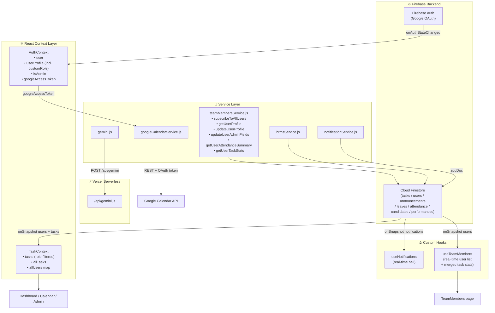

# AirBuddy Aerospace WorkSpace — `memory.md`

> **Purpose:** This document is the single source of truth for AI development sessions.
> Any AI assistant working on this project MUST read this file first before writing any code.
> Last generated from full codebase analysis.

---

## Table of Contents

1. [Project Overview](#1-project-overview)
2. [Tech Stack & Tools](#2-tech-stack--tools)
3. [Folder Structure & Architecture](#3-folder-structure--architecture)
4. [Data Flow & State Management](#4-data-flow--state-management)
5. [Database Schema (Firestore)](#5-database-schema-firestore)
6. [Security Model (Firestore Rules)](#6-security-model-firestore-rules)
7. [Development Rules & Best Practices](#7-development-rules--best-practices)
8. [Environment Variables Reference](#8-environment-variables-reference)
9. [Known Issues & Technical Debt](#9-known-issues--technical-debt)
10. [Deployment Architecture](#10-deployment-architecture)

---

## 1. Project Overview

### What Is This?

**AirBuddy Aerospace WorkSpace** is a private, internal workforce management platform built exclusively for the AirBuddy Aerospace team. It is a full-stack Single Page Application (SPA) that combines task management, HR operations, team visibility, and an AI assistant into one dark-themed, modern interface.

Think of it as **Jira + Google Calendar + Slack announcements + an AI assistant + a full HR suite**, built specifically for an aerospace team.

### Who Uses It?

Two RBAC roles govern all access:

| Role | What They Can Do |
|---|---|
| `employee` | View & update own tasks, personal task creation, calendar view, announcements, AI chat, attendance punch in/out, apply for leaves, view own performance reviews, view all Team Member profiles |
| `admin` | Everything above + assign tasks, manage all tasks, post announcements, manage Employee Directory, approve/reject leaves, manage Recruitment pipeline, write Performance reviews, assign custom display roles to any user |

### Main Features

- **Dashboard** — Real-time stat cards, 3 interactive charts (Donut, Bar, Line), filterable task grid.
- **Calendar View** — Tasks as color-coded `react-big-calendar` events with List View toggle.
- **Team Members** — Public profile grid (all users). Any user can view profiles; owners and admins can edit. Cards show live task stats, lazy-loaded attendance rate, social links, and skills. RBAC+custom role badge.
- **HRMS Suite:**
  - **Employee Directory** — Full CRUD on employee HR records (department, designation, salary).
  - **Attendance & Leaves** — Daily punch in/out, leave requests with admin approval workflow.
  - **Recruitment Board** — Kanban pipeline: Applied → Interviewing → Hired → Rejected.
  - **Performance Reviews** — Periodic skill-based reviews with goal tracking.
- **Admin Panel** — Comprehensive admin portal (team overview, task monitor, announcements, employee management).
- **Work Partner** — Shows shared tasks between colleagues. Employees see tasks they are assigned to or partnered on. **Admins see all tasks with any collaboration (multi-assignee or work partners)**. Dynamic status filters (All / Pending / In-Progress / Completed).
- **Collaboration Timeline** — GitHub-style real-time event feed per task. Records `partner_added`, `status_changed`, `progress_updated`, and manual `commit` events. Accessible from `TaskDetailModal` and the Work Partner drawer.
- **AI Assistant (AirBuddy AI)** — Floating chat widget powered by Gemini 2.5 Flash Lite via a Vercel serverless proxy. Context-aware (live task list injected).
- **Notifications** — Firestore-backed in-app notification bell + browser Web Notifications.
- **Google Calendar Sync** — Syncs tasks to user's Google Calendar via OAuth token.
- **Google OAuth Login** — Only login method; first login auto-creates employee profile.

---

## 2. Tech Stack & Tools

### Frontend

| Tool | Version | Role |
|---|---|---|
| **React** | 19.2.x | UI framework — functional components + hooks ONLY |
| **Vite** | 7.3.x | Build tool and dev server |
| **React Router DOM** | 7.13.x | Client-side routing (v7 API) |
| **Tailwind CSS** | 3.4.x | All styling — utility classes only, no inline styles |

### Backend & Database

| Tool | Version | Role |
|---|---|---|
| **Firebase Auth** | via `firebase` 12.10 | Google OAuth sign-in, session management |
| **Cloud Firestore** | via `firebase` 12.10 | Primary NoSQL database, real-time `onSnapshot` listeners |
| **Firebase Cloud Messaging** | via `firebase` 12.10 | Push notifications (requires Blaze plan + Service Worker) |
| **Firebase Cloud Functions** | `firebase-functions` 7.1.x | Server-side FCM triggers |
| **Firebase Admin SDK** | `firebase-admin` 13.7.x | Used inside Cloud Functions only |

### AI & External APIs

| Tool | Role |
|---|---|
| **Google Gemini 2.5 Flash Lite** (`@google/genai` 1.44) | AI assistant backend model |
| **Vercel Serverless Function** (`/api/gemini.js`) | Secure Gemini proxy — API key never reaches the browser |
| **Google Calendar REST API v3** | Syncs tasks as all-day events using user OAuth token |

### Key UI Libraries

| Library | Role |
|---|---|
| `react-big-calendar` + `moment` | Full calendar UI |
| `chart.js` + `react-chartjs-2` | Dashboard charts (Donut, Bar, Line) |
| `date-fns` | All date formatting and manipulation |

---

## 3. Folder Structure & Architecture

```
Work_flow/
│
├── api/
│   └── gemini.js                     ← Vercel serverless Gemini proxy
│
├── functions/                        ← Firebase Cloud Functions (FCM triggers)
│   ├── index.js
│   └── package.json
│
├── src/
│   ├── main.jsx                      ← React 19 entry point
│   ├── App.jsx                       ← Router + ProtectedRoute + AdminRoute guards
│   ├── index.css                     ← Tailwind directives + custom CSS classes
│   │
│   ├── context/
│   │   ├── AuthContext.jsx           ← Auth state, userProfile, isAdmin, googleAccessToken
│   │   └── TaskContext.jsx           ← Real-time tasks + allUsers map (onSnapshot)
│   │
│   ├── services/                     ← ALL Firestore/API calls live here. No direct Firebase in components.
│   │   ├── firebase.js               ← Firebase init, Auth, Firestore, FCM exports
│   │   ├── gemini.js                 ← Builds system prompt, calls /api/gemini
│   │   ├── googleCalendarService.js  ← Creates Google Calendar events via REST API
│   │   ├── hrmsService.js            ← HRMS CRUD: attendance, leaves, candidates, performance
│   │   ├── notificationService.js    ← Writes Firestore notifications + triggers browser alerts
│   │   ├── collaborationService.js   ← [NEW] All Work Partner + Collaboration Timeline Firestore ops
│   │   └── teamMembersService.js     ← Team Members feature: user reads, profile updates, attendance summary, task stats
│   │
│   ├── hooks/
│   │   ├── useNotifications.js       ← Real-time Firestore listener for notification bell
│   │   ├── useTaskTimeline.js        ← [NEW] Real-time subscription to a task's events subcollection
│   │   └── useTeamMembers.js         ← Real-time user list + merged task stats for Team Members page
│   │
│   ├── utils/
│   │   ├── dateHelpers.js            ← formatDate, getDueDateLabel, toDate, etc.
│   │   └── permissions.js            ← canEditTask, canUpdateProgress, MODULE_OPTIONS
│   │
│   ├── pages/
│   │   ├── AppLayout.jsx             ← Authenticated shell: Navbar + Sidebar + Outlet + AI button
│   │   └── LoginPage.jsx             ← Google sign-in page (public route)
│   │
│   └── components/
│       ├── shared/
│       │   ├── Charts.jsx            ← DonutChart, BarChart, LineChart wrappers
│       │   ├── Modal.jsx             ← Generic reusable modal (isOpen, onClose, title, size)
│       │   ├── Navbar.jsx            ← Top bar, notification bell, user menu with RoleBadge
│       │   ├── RoleBadge.jsx         ← [NEW] Single source of truth for role display: customRole > admin > employee
│       │   ├── Sidebar.jsx           ← Left nav, active NavLinks, HRMS section, RoleBadge footer
│       │   └── TaskCard.jsx          ← Task card with PriorityBadge, StatusBadge, ProgressBar
│       │
│       ├── HRMS/
│       │   ├── Attendance/
│       │   │   ├── AttendanceManager.jsx
│       │   │   └── LeaveManagement.jsx
│       │   ├── Directory/
│       │   │   ├── EditProfileModal.jsx  ← [NEW] Edit own profile (or any profile for admin); admin controls section
│       │   │   ├── EmployeeDirectory.jsx
│       │   │   ├── EmployeeModal.jsx
│       │   │   ├── ProfileCard.jsx       ← [NEW] Team member card with stats, social links, RoleBadge
│       │   │   ├── TeamMembers.jsx       ← [NEW] /team page: searchable grid of ProfileCards
│       │   │   └── ViewProfileModal.jsx  ← [NEW] Read-only profile modal for non-owners
│       │   ├── Performance/
│       │   │   └── PerformanceDashboard.jsx
│       │   └── Recruitment/
│       │       └── RecruitmentBoard.jsx
│       │
│       ├── Dashboard/
│       │   ├── EmployeeDashboard.jsx
│       │   └── SelfTaskModal.jsx
│       ├── Admin/
│       │   └── AdminPanel.jsx
│       ├── Calendar/
│       │   ├── CalendarView.jsx
│       │   ├── ListView.jsx
│       │   └── TaskDetailModal.jsx
│       ├── WorkPartner/
│       │   ├── WorkPartner.jsx              ← Work Partner page (admin sees all, user sees own)
│       │   ├── WorkPartnersSection.jsx      ← [NEW] Partner chips + Add Partner button inside TaskDetailModal
│       │   ├── WorkPartnerSelector.jsx      ← [NEW] GitHub-style teammate autocomplete popover
│       │   └── TaskTimeline.jsx             ← [NEW] Real-time vertical event timeline per task
│       ├── Announcement/
│       │   └── AnnouncementList.jsx
│       ├── About/
│       │   └── AboutPage.jsx
│       └── AIAssistant/
│           └── AIAssistantButton.jsx
│
├── firestore.rules
├── tailwind.config.js                ← Custom design tokens
├── vite.config.js
├── vercel.json
└── package.json
```

### Key Folder Rules

| Folder | Strict Rule |
|---|---|
| `/services` | **Every** Firebase/API call lives here. Components import service functions, never `firebase/firestore` directly. Exception: `AuthContext` uses `getDoc/setDoc` for initial profile creation. |
| `/context` | Only `AuthContext` and `TaskContext` exist. Do NOT create new contexts without strong justification. |
| `/hooks` | Custom hooks that encapsulate `useState + useEffect` for reusable data patterns. |
| `/utils` | Pure functions only. No React, no Firebase. Deterministic input → output. |
| `/components/shared` | Generic, reusable building blocks used across multiple features. |

---

## 4. Data Flow & State Management

### Provider Hierarchy

```jsx
<BrowserRouter>
  <AuthProvider>           ← Auth state available everywhere
    <AppRoutes>
      <ProtectedRoute>
        <TaskProvider>     ← Task + allUsers data available inside authenticated pages
          <AppLayout>
            <Navbar />     ← reads useAuth(), useNotifications()
            <Sidebar />    ← reads useAuth()
            <Outlet />     ← page components render here
            <AIAssistantButton />
          </AppLayout>
        </TaskProvider>
      </ProtectedRoute>
    </AppRoutes>
  </AuthProvider>
</BrowserRouter>
```

### Active Route Map

| Path | Component | Guard |
|---|---|---|
| `/` | `EmployeeDashboard` | ProtectedRoute |
| `/calendar` | `CalendarView` | ProtectedRoute |
| `/work-partner` | `WorkPartner` | ProtectedRoute |
| `/team` | `TeamMembers` | ProtectedRoute |
| `/announcements` | `AnnouncementList` | ProtectedRoute |
| `/about` | `AboutPage` | ProtectedRoute |
| `/admin` | `AdminPanel` | ProtectedRoute + AdminRoute |
| `/hrms/directory` | `EmployeeDirectory` | ProtectedRoute |
| `/hrms/attendance` | `AttendanceManager` | ProtectedRoute |
| `/hrms/leaves` | `LeaveManagement` | ProtectedRoute |
| `/hrms/recruitment` | `RecruitmentBoard` | ProtectedRoute |
| `/hrms/performance` | `PerformanceDashboard` | ProtectedRoute |

### Data Flow Diagram



### Team Members Feature — Data Flow Detail

```
useTeamMembers hook
  ├── subscribeToAllUsers()  → onSnapshot on users/ collection (real-time)
  │     └── merges getUserTaskStats(uid, allTasks) synchronously per user
  └── fetchAttendanceIfNeeded(uid)  → called lazily when a card is opened
        └── getUserAttendanceSummary(uid)  → getDocs on attendance/{uid}/records/
```

---

## 5. Database Schema (Firestore)

### Collections Overview

| Collection | Purpose |
|---|---|
| `users/` | One doc per registered user (auth + profile + HR fields) |
| `tasks/` | All tasks (admin-assigned and personal) |
| `announcements/` | Admin-posted team announcements |
| `notifications/{uid}/items/` | Per-user notification subcollection |
| `leaves/` | HRMS leave requests |
| `attendance/{uid}/records/` | Per-user punch in/out records |
| `candidates/` | Recruitment pipeline candidates |
| `performances/` | Periodic employee review records |

### `users/{uid}` — Full Schema (Current)

```javascript
{
  // Auth fields (written on first login, never changed by user)
  uid:          "firebase_auth_uid",
  name:         "Ajit Kumar",
  email:        "ajit.info999@gmail.com",
  role:         "employee",        // RBAC: "employee" | "admin" — NEVER expose edit to employees
  avatar:       "https://lh3.google.com/...",
  fcmToken:     "fcm_device_token",
  createdAt:    Timestamp,

  // Self-editable profile fields (via updateUserProfile() service whitelist)
  bio:          "Short personal bio",
  phone:        "+91 98765 43210",
  skills:       ["React", "Firebase", "Python"],
  socialLinks: {
    github:    "https://github.com/username",
    linkedin:  "https://linkedin.com/in/username",
    instagram: "https://instagram.com/username",
    portfolio: "https://mysite.com"
  },

  // Admin-only HR fields (via updateUserAdminFields() — Firestore rules enforce this)
  customRole:   "Team Lead",       // Display-only label shown in RoleBadge everywhere (violet badge)
  department:   "Avionics",
  designation:  "Systems Engineer",
  joinDate:     Timestamp,
  salaryBase:   80000,
  updatedAt:    Timestamp
}
```

> ⚠️ **Critical distinction:**
> - `role` = RBAC access control (`"admin"` or `"employee"`). Changing this grants/revokes full admin power. Only writable by admins via `updateUserAdminFields()`. Firestore rules block employee writes to this field.
> - `customRole` = display-only label (e.g. `"Team Lead"`). Set by admin. Shown as a **violet badge** everywhere in the UI via `<RoleBadge>`. Has zero effect on permissions.

### `tasks/{taskId}`

```javascript
{
  title:          "Avionics Integration Testing",
  description:    "Complete phase 2 integration...",
  module:         "Avionics",           // from MODULE_OPTIONS in permissions.js
  priority:       "high",               // "high" | "medium" | "low"
  status:         "in-progress",        // "pending" | "in-progress" | "completed"
  progress:       45,                   // 0–100
  startDate:      Timestamp,
  dueDate:        Timestamp,
  assignedTo:     ["uid_1", "uid_2"],   // string[] — array of assignee UIDs
  assignedBy:     "admin_uid",
  createdBy:      "creator_uid",
  isAdminTask:    true,                 // false = personal task
  links:          [{ url: "...", label: "Doc" }],
  attachments:    [{ url: "...", name: "PR" }],
  isExtended:     false,
  completionNote: { message: "...", completedAt: Timestamp, completedBy: "Name" },
  createdAt:      Timestamp,
  updatedAt:      Timestamp
}
``` 

### `tasks/{taskId}` — Updated Schema (Work Partner fields added)

```javascript
{
  // ... all original fields unchanged ...

  // [NEW] Work Partner Arrays — always updated atomically together
  workPartners: [             // Rich objects — used by UI for display
    {
      uid:         "partner_uid",
      name:        "Arjun Sharma",
      avatar:      "https://lh3.google.com/...",
      addedBy:     "adder_uid",
      addedByName: "Alisha Khan",
      addedAt:     "2026-04-06T02:00:00.000Z"   // ISO string (NOT serverTimestamp — Firestore limitation with arrayUnion)
    }
  ],
  workPartnerUids: ["partner_uid"],  // Flat UID array — ONLY used for Firestore security rules
                                      // Rules cannot query inside array-of-maps, so this enables `request.auth.uid in workPartnerUids`
}
```

### `tasks/{taskId}/events/{eventId}` — New Subcollection

```javascript
{
  type:         "partner_added",   // "partner_added" | "status_changed" | "progress_updated" | "commit"
  authorUid:    "uid",             // Triggering user (client-provided; validated by rules)
  authorName:   "Ajit Kumar",      // Denormalized for timeline reads
  authorAvatar: "https://...",
  message:      "Ajit Kumar added Aarush Bhagat as a work partner",
  metadata: {
    // For partner_added:     { partnerName, partnerUid, partnerAvatar }
    // For status_changed:    { oldStatus, newStatus }
    // For progress_updated:  { oldProgress, newProgress }
    // For commit:            { branch, message }    — branch is the commit message body
  },
  createdAt: serverTimestamp()
}
```

### `leaves/{leaveId}`

```javascript
{
  uid:           "applicant_uid",
  applicantName: "Ajit Kumar",
  type:          "sick",           // "sick" | "casual" | "unpaid"
  startDate:     "2024-05-10",     // YYYY-MM-DD string
  endDate:       "2024-05-12",
  reason:        "Medical appointment",
  status:        "pending",        // "pending" | "approved" | "rejected"
  reviewedBy:    "admin_uid",      // set on approval/rejection
  createdAt:     Timestamp,
  updatedAt:     Timestamp
}
```

### `attendance/{uid}/records/{recordId}`

```javascript
{
  date:      "2024-05-10",   // YYYY-MM-DD string (used for querying)
  punchIn:   Timestamp,
  punchOut:  Timestamp | null,   // null = still clocked in
  createdAt: Timestamp,
  updatedAt: Timestamp
}
```

### `candidates/{candidateId}`

```javascript
{
  name:       "Ajit kumar",
  email:      "[EMAIL_ADDRESS]",
  role:       "Data Scientist",
  experience: "3 years",
  resumeUrl:  "https://...",
  status:     "Applied",     // "Applied" | "Interviewing" | "Hired" | "Rejected"
  notes:      "Strong algorithms background",
  createdAt:  Timestamp,
  updatedAt:  Timestamp
}
```

### `performances/{reviewId}`

```javascript
{
  uid:           "employee_uid",
  employeeName:  "Ajit Kumar",
  reviewedBy:    "admin_uid",
  period:        "Q1 2024",
  skills: {
    communication: 4,   // 1–5
    technical:     5,
    leadership:    3,
    teamwork:      4,
    punctuality:   5
  },
  goalsAssigned:  5,
  goalsCompleted: 4,
  notes:          "Solid performance on the radar module.",
  createdAt:      Timestamp
}
```

---

## 6. Security Model (Firestore Rules)

Helper functions available in all rules:
```javascript
isAuthenticated()  // request.auth != null
isAdmin()          // authenticated + user doc exists + role == 'admin'
```

### `users/{userId}` — Current Rule (updated for Team Members)

```javascript
match /users/{userId} {
  allow read: if isAuthenticated();   // Full grid read for Team Members page

  allow create: if isAuthenticated()  // First-time login creates own profile
    && request.auth.uid == userId
    && request.resource.data.role == 'employee';

  allow update: if isAuthenticated() && (
    isAdmin()
    || (
      request.auth.uid == userId
      && !request.resource.data.diff(resource.data)
          .affectedKeys()
          // Employees CANNOT change these fields even on their own doc:
          .hasAny(['role', 'uid', 'email', 'salaryBase', 'department', 'designation', 'fcmToken'])
    )
  );

  allow delete: if isAdmin();
}
```

### All Collections Summary

| Collection | Read | Write |
|---|---|---|
| `users` | Any authenticated | Self: only safe fields (`avatar`, `bio`, `phone`, `skills`, `socialLinks`). Admin: full. |
| `tasks` | Admin: all. Employee: assigned-to, created-by, or in workPartnerUids. | Admin: all. Employee: create personal tasks; update `progress`/`status`/`dueDate` on assigned tasks; update workPartners/workPartnerUids as any participant. |
| `tasks/{taskId}/events` | Any task participant (assignee, creator, or work partner) | Any task participant can create. No update/delete allowed. |
| `announcements` | Any authenticated | Create/Delete: admin. Update: any user can only update the `isRead` array field. |
| `notifications/{uid}/items` | Owner only | Any authenticated can CREATE (for cross-user notifications). Owner can read/update/delete. |
| `leaves` | Owner or admin | Create: own (status must be `'pending'`). Update/Delete: admin only. |
| `attendance/{uid}/records` | Owner or admin | Create/Update: owner only. Delete: admin only. |
| `candidates` | Any authenticated | Create/Update/Delete: admin only. |
| `performances` | Owner or admin | Create/Update/Delete: admin only. |

---

## 7. Development Rules & Best Practices

### Rule 1: Functional Components Only
Always write functional components with hooks. Never class components.

### Rule 2: Tailwind CSS Only — No Inline Styles
All styling via Tailwind utility classes. No `style={{}}` for layout/color/spacing.
**Exception:** Data-driven values only — e.g. `style={{ width: \`${progress}%\` }}` or `backgroundImage` for CSS gradients.

**Custom Tailwind tokens (must use these, not raw hex):**
- Backgrounds: `bg-background`, `bg-surface`, `bg-surfaceHover`
- Borders: `border-border`, `border-borderLight`
- Text: `text-text-primary`, `text-text-secondary`, `text-text-muted`
- Orange accent: `text-orange`, `bg-orange`, `bg-orange-muted`, `border-orange`

**Custom CSS classes (from `src/index.css`):**
`btn-primary`, `btn-secondary`, `btn-ghost`, `card`, `card-hover`, `input-field`, `select-field`, `badge`, `badge-orange`, `section-title`, `progress-bar`, `progress-fill`, `animate-fade-in`

### Rule 3: Database Access — Service Files Only
Components NEVER import from `firebase/firestore` or use `db` directly.
All reads/writes go through `src/services/` functions.

**Service responsibilities:**
- `collaborationService.js` — [NEW] Work Partner + Collaboration Timeline: `addWorkPartner`, `removeWorkPartner`, `addTimelineEvent`, `postCommit`, `subscribeToTimeline`, `recordStatusChange`, `recordProgressUpdate`, `checkCanAddPartner`
- `teamMembersService.js` — Team Members reads/writes (`subscribeToAllUsers`, `updateUserProfile`, `updateUserAdminFields`, `getUserAttendanceSummary`, `getUserTaskStats`)
- `hrmsService.js` — HRMS CRUD (attendance, leaves, candidates, performance)
- `googleCalendarService.js` — Google Calendar event creation
- `notificationService.js` — Notification writes + browser alerts
- `gemini.js` — AI system prompt builder + API call

### Rule 4: Real-Time Data — Context Hooks Only
For tasks and user data, always consume `useTasks()` or `useAuth()`. Never `getDocs()` inside components for data that needs to stay live.

### Rule 5: Date Handling — `dateHelpers.js`
Never use raw `new Date().toLocaleDateString()` in JSX. Always use `formatDate()`, `getDueDateLabel()`, `toDate()`, etc. from `src/utils/dateHelpers.js`. Firestore Timestamps must be converted with `.toDate()` before use.

### Rule 6: Permission Checks
Before rendering edit/delete controls: check `isAdmin` from `useAuth()` or use `canEditTask()` / `canUpdateProgress()` from `src/utils/permissions.js`.

### Rule 7: Error Handling Pattern
Every async Firebase/API call must follow this pattern:
```javascript
const [saving, setSaving] = useState(false);
const handleSave = async () => {
  setSaving(true);
  try {
    await someServiceFunction(...);
  } catch (err) {
    console.error('[ComponentName] action failed:', err);
    setErrorMessage('Could not save. Please try again.');
  } finally {
    setSaving(false);
  }
};
```

### Rule 8: Client-Side Sorting (Avoid Composite Firestore Indexes)
Queries in `hrmsService.js` and `teamMembersService.js` use a **single `where()` clause** and sort results client-side with `.sort()`. Do NOT add `orderBy()` alongside `where()` unless the required composite index has been explicitly created in the Firebase Console.

### Rule 9: Role Display — Always Use `<RoleBadge>` [NEW]
**Never** display a user's role label with ad-hoc inline markup. Always import and use `<RoleBadge role={user.role} customRole={user.customRole} />` from `src/components/shared/RoleBadge.jsx`.

Badge priority logic (single source of truth):
- `customRole` present → **violet badge** (admin-assigned display label)
- `role === 'admin'` → **orange badge** (`⭐ Admin`)
- default → **blue badge** (`Employee`)

This ensures every location (Navbar, Sidebar, ProfileCard, ViewProfileModal) shows identical role styling.

### Rule 10: Lazy Loading for Per-User Sub-Collections [NEW]
Per-user subcollections (`attendance`, `notifications`) must **never** be fetched for all users on page load. Use a lazy "fetch on demand" pattern — only load when the specific user's card/modal is opened. Cache results in a local `{ [uid]: data }` map to prevent duplicate reads.

### Rule 11: Work Partner Dual-Array Pattern [NEW]
The `workPartners` array (rich objects) and `workPartnerUids` array (flat UIDs) MUST always be updated in the same atomic `updateDoc()` call. Firestore security rules cannot do `in` checks on arrays of maps, so `workPartnerUids` is the rules-layer enforcement mechanism.

**Never use `arrayRemove()` on a map object** — it is unreliable. Always replace the full array using the filtered result: `workPartners.filter(p => p.uid !== removedUid)`.

**Never use `serverTimestamp()` inside `arrayUnion()`** — Firestore forbids this. Use `new Date().toISOString()` for timestamps stored inside array objects.

### Rule 12: Firestore Rules — Safe Property Access [NEW]
When accessing Firestore document fields inside security rules, use safe access patterns to prevent `PropertyMissingError` crashes:
- ✅ `'fieldName' in resource.data && resource.data.fieldName == value`
- ✅ `resource.data.get('fieldName', defaultValue)`
- ❌ `resource.data.fieldName == value` (crashes if field is missing)

Always deploy rule changes with: `npx firebase deploy --only firestore:rules --project airbuddy-workspace`

---

## 8. Environment Variables Reference

### Frontend (`VITE_` prefix — available in browser)
```env
VITE_FIREBASE_API_KEY=
VITE_FIREBASE_AUTH_DOMAIN=
VITE_FIREBASE_PROJECT_ID=airbuddy-workspace
VITE_FIREBASE_STORAGE_BUCKET=
VITE_FIREBASE_MESSAGING_SENDER_ID=
VITE_FIREBASE_APP_ID=
VITE_FIREBASE_MEASUREMENT_ID=
VITE_FIREBASE_VAPID_KEY=
VITE_GOOGLE_CLIENT_ID=
VITE_GOOGLE_CALENDAR_API_KEY=
```

### Server-Side Only (Vercel Dashboard — NOT in `.env`)
```env
GEMINI_API_KEY=    # Never prefix with VITE_ — would expose to browser
```

---

## 9. Known Issues & Technical Debt

| Issue | Severity | Description |
|---|---|---|
| FCM Service Worker missing | 🔴 High | `firebase-messaging-sw.js` not in `public/`. Background push notifications will silently fail. |
| Google Calendar OAuth scope | 🔴 High | `googleProvider.addScope(...)` may be commented out in `firebase.js`. Calendar sync returns 403 if so. |
| `googleCalendar.js` is dead code | 🟢 Low | `src/services/googleCalendar.js` is never imported anywhere. Only `googleCalendarService.js` is active. Safe to delete. |
| OAuth token 1-hour expiry | 🟢 Low | Google OAuth tokens expire after 1 hour. `refreshGoogleToken()` triggers a popup — disruptive UX. |
| `updateEmployeeHRDetails` deprecated | 🟢 Low | Exists in `hrmsService.js` for backwards compatibility only. Use `updateEmployee()`. |
| No Vite dev proxy for `/api` | 🟡 Medium | `/api/gemini` 404s on `npm run dev`. Requires `vercel dev` for full-stack local development. |
| No React Error Boundaries | 🟡 Medium | A crash in Dashboard or AdminPanel shows a blank screen. Add Error Boundaries to major routes. |

---

## 10. Deployment Architecture

```
User Browser
    │
    ▼
Vercel (Frontend + Serverless)
    ├── /              → React SPA (dist/ from npm run build)
    └── /api/gemini    → Vercel Serverless Function (Node.js)
                                    │
                                    ▼
                        Google Gemini 2.5 Flash Lite API

Firebase (Backend Services)
    ├── Firebase Authentication  → Google OAuth provider
    ├── Cloud Firestore          → Primary database (asia-south1)
    ├── Firebase Cloud Messaging → Push notifications (Blaze plan required)
    └── Cloud Functions          → FCM triggers
```

### Commands

```bash
npm run dev       # Frontend only (AI chat won't work — no /api route)
vercel dev        # Full stack including /api/gemini serverless function
npm run build     # Production build
vercel --prod     # Deploy to production

npx firebase-tools deploy --only firestore:rules   # Deploy security rules
npx firebase-tools deploy --only functions         # Deploy Cloud Functions (Blaze plan)
```

### Setting Up a New Admin

1. User signs in via Google (auto-creates `employee` profile in Firestore).
2. Go to Firebase Console → Firestore → `users/` → find their document.
3. Change `role` field from `"employee"` to `"admin"`.
4. User refreshes — Admin Panel link appears immediately.

---

*This document was generated from full codebase analysis of AirBuddy Aerospace WorkSpace.*
*Last updated: 2026-04-06 (Collaboration Timeline + Work Partner v2 features added)*
*Update this file whenever major architectural changes are made.*
